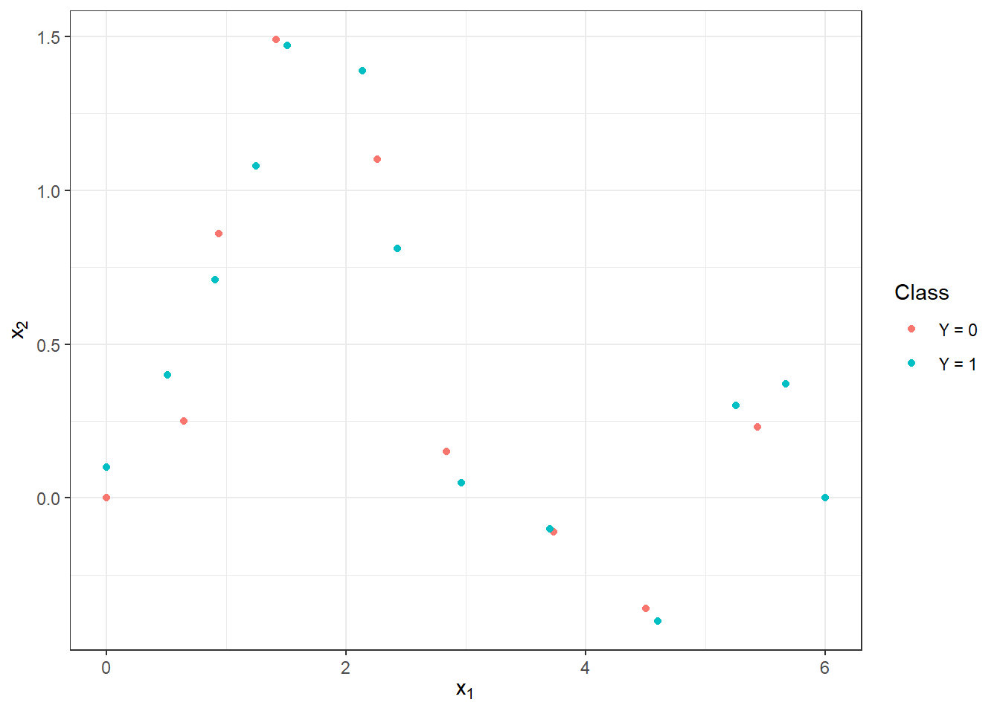
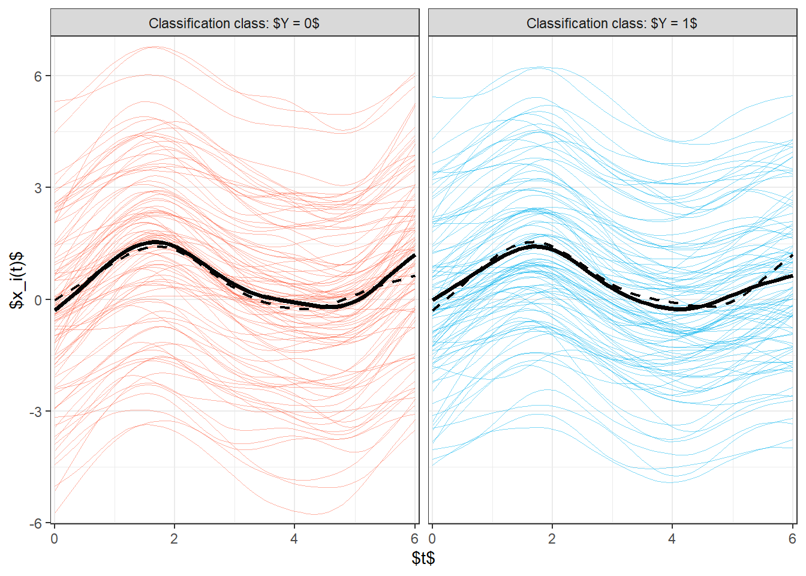
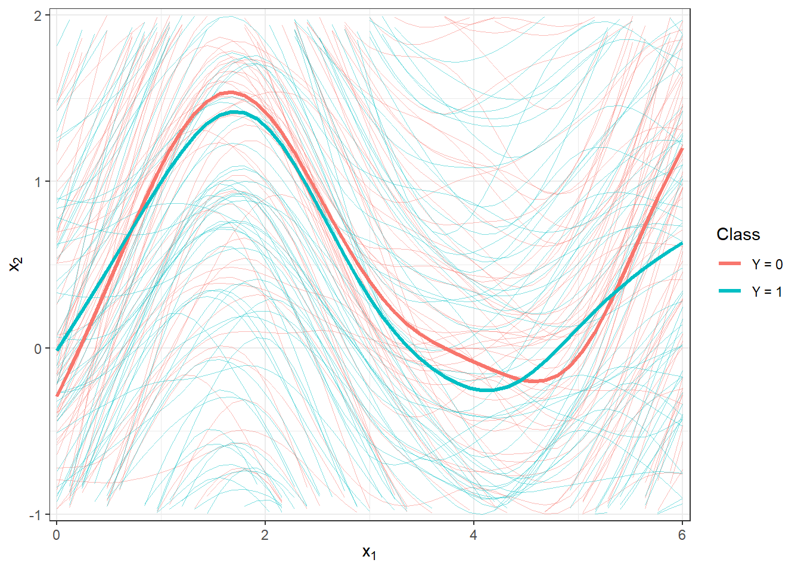
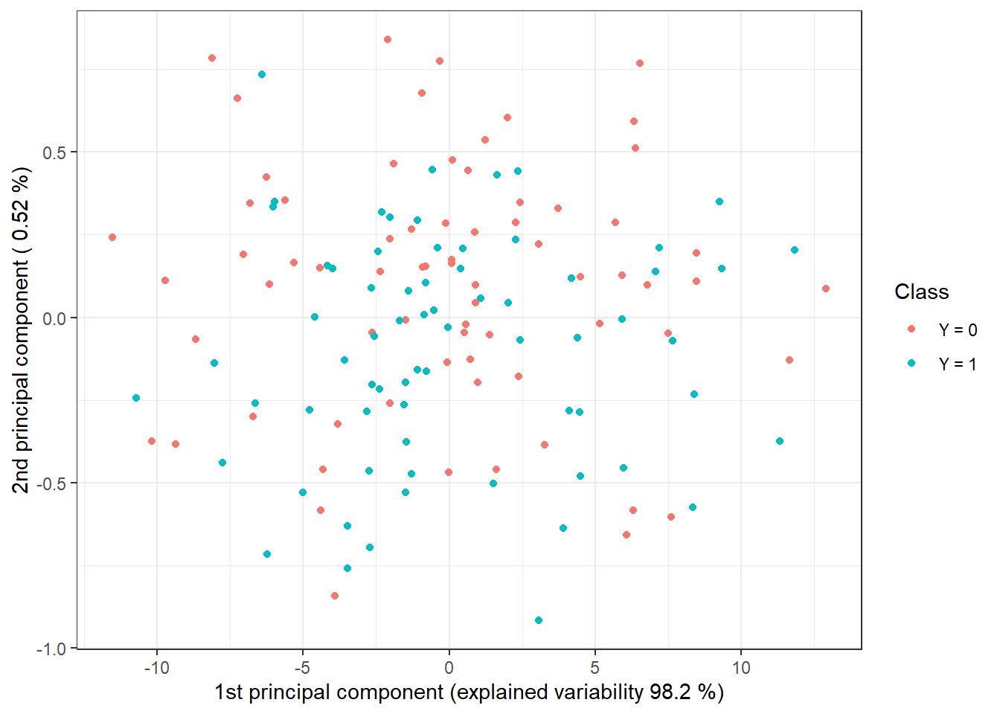
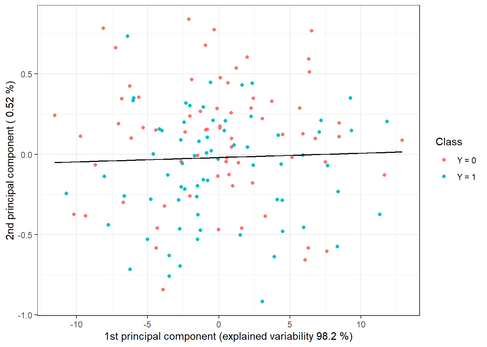

# Simulation {#simulace3}

## Simulation of Functional Data

First, we simulate functions that we will subsequently classify.
For simplicity, we will consider two classification classes.
For the simulation, we will first:

-   choose appropriate functions,

-   generate points from a selected interval, which contain, for example, Gaussian noise,

-   smooth these obtained discrete points into a functional object form using a suitable basis system.

Through this process, we obtain functional objects along with the value of a categorical variable $Y$, which distinguishes membership in the classification class.


``` r
library(fda)
library(ggplot2)
library(dplyr)
library(tidyr)
library(ddalpha)
library(polynom)

set.seed(42)
```

Let us consider two classification classes, $Y \in \{0, 1\}$, with the same number `n` of generated functions for each class.
First, let’s define two functions, each corresponding to one class.
We will consider the functions on the interval $I = [0, 6]$.

Now, we will create the functions using interpolation polynomials. First, we define the points through which our curve should pass, and then we fit an interpolation polynomial through them, which we use to generate curves for classification.


``` r
# defining points for class 0
x.0 <- c(0.00, 0.65, 0.94, 1.42, 2.26, 2.84, 3.73, 4.50, 5.43, 6.00)
y.0 <- c(0, 0.25, 0.86, 1.49, 1.1, 0.15, -0.11, -0.36, 0.23, 0)

# defining points for class 1
x.1 <- c(0.00, 0.51, 0.91, 1.25, 1.51, 2.14, 2.43, 2.96, 3.70, 4.60,
         5.25, 5.67, 6.00)
y.1 <- c(0.1, 0.4, 0.71, 1.08, 1.47, 1.39, 0.81, 0.05, -0.1, -0.4,
         0.3, 0.37, 0)
```


``` r
dat_points <- data.frame(x = c(x.0, x.1),
                         y = c(y.0, y.1),
                         Class = rep(c('Y = 0', 'Y = 1'), 
                                     c(length(x.0), length(x.1))))

ggplot(dat_points, aes(x = x, y = y, colour = Class)) + 
  geom_point(size=1.5) + 
  theme_bw() + 
  labs(x = expression(x[1]),
       y = expression(x[2]),
       colour = 'Class')
```

<div class="figure">

<p class="caption">(\#fig:unnamed-chunk-3)Points defining interpolation polynomials for both classification classes.</p>
</div>

To compute the interpolation polynomials, we will use the `poly.calc()` function from the `polynom` library. Next, we define the functions `poly.0()` and `poly.1()`, which will calculate the polynomial values at a given point in the interval. We use the `predict()` function to create them, where we input the respective polynomial and the point at which we want to evaluate the polynomial.


``` r
polynom.0 <- poly.calc(x.0, y.0)
polynom.1 <- poly.calc(x.1, y.1)
```


``` r
poly.0 <- function(x) return(predict(polynom.0, x))
poly.1 <- function(x) return(predict(polynom.1, x))
```


``` r
xx <- seq(min(x.0), max(x.0), length = 501)
yy.0 <- poly.0(xx)
yy.1 <- poly.1(xx)

dat_poly_plot <- data.frame(x = c(xx, xx),
                            y = c(yy.0, yy.1),
                            Class = rep(c('Y = 0', 'Y = 1'), 
                                        c(length(xx), length(xx))))

ggplot(dat_points, aes(x = x, y = y, colour = Class)) + 
  geom_point(size=1.5) + 
  theme_bw() + 
  geom_line(data = dat_poly_plot,
            aes(x = x, y = y, colour = Class),
            linewidth = 0.8) + 
  labs(x = expression(x[1]),
       y = expression(x[2]),
       colour = 'Class')
```

<div class="figure">

<p class="caption">(\#fig:unnamed-chunk-6)Visualization of two functions on the interval $I = [0, 6]$, from which we generate observations for classes 0 and 1.</p>
</div>


``` r
funkce_0 <- poly.0
funkce_1 <- poly.1
```

Now we will create a function to generate random functions with added noise (i.e., points on a predefined grid) from a chosen generating function.
The argument `t` represents the vector of values at which we want to evaluate the given functions, `fun` denotes the generating function, `n` is the number of functions, and `sigma` is the standard deviation $\sigma$ of the normal distribution $\text{N}(\mu, \sigma^2)$, from which we randomly generate Gaussian white noise with $\mu = 0$.
To demonstrate the advantage of using methods that work with functional data, we will add a random term to each simulated observation during generation, representing a vertical shift of the entire function (parameter `sigma_shift`).
This shift will be generated from a normal distribution with the parameter $\sigma^2 = 4$.


``` r
generate_values <- function(t, fun, n, sigma, sigma_shift = 0) {
  # Arguments:
  # t ... vector of values, where the function will be evaluated
  # fun ... generating function of t 
  # n ... the number of generated functions / objects
  # sigma ... standard deviation of normal distribution to add noise to data
  # sigma_shift ... parameter of normal distribution for generating shift
  
  # Value:
  # X ... matrix of dimension length(t) times n with generated values of one 
  # function in a column 
  
  X <- matrix(rep(t, times = n), ncol = n, nrow = length(t), byrow = FALSE)
  noise <- matrix(rnorm(n * length(t), mean = 0, sd = sigma),
                  ncol = n, nrow = length(t), byrow = FALSE)
  shift <- matrix(rep(rnorm(n, 0, sigma_shift), each = length(t)),
                  ncol = n, nrow = length(t))
  return(fun(X) + noise + shift)
}
```

Now we can generate the functions. In each of the two classes, we will consider 100 observations, so `n = 100`.


``` r
n <- 100
t <- seq(0, 6, length = 51)

# Y = 0
X0 <- generate_values(t, funkce_0, n, 1, 2)
# Y = 1
X1 <- generate_values(t, funkce_1, n, 1, 2)
```

We will plot the generated (not yet smoothed) functions in color according to their class (only the first 10 observations from each class for clarity).


``` r
n_curves_plot <- 10 

DF0 <- cbind(t, X0[, 1:n_curves_plot]) |> 
  as.data.frame() |> 
  reshape(varying = 2:(n_curves_plot + 1), direction = 'long', sep = '') |> 
  subset(select = -id) |> 
  mutate(
  time = time - 1,
  group = 0
  )

DF1 <- cbind(t, X1[, 1:n_curves_plot]) |> 
  as.data.frame() |> 
  reshape(varying = 2:(n_curves_plot + 1), direction = 'long', sep = '') |> 
  subset(select = -id) |> 
  mutate(
  time = time - 1,
  group = 1
  )

DF <- rbind(DF0, DF1) |>
  mutate(group = factor(group))

DF |> ggplot(aes(x = t, y = V, group = interaction(time, group), 
                 colour = group)) + 
  geom_line(linewidth = 0.5) +
  theme_bw() +
  labs(x = expression(x[1]),
       y = expression(x[2]),
       colour = 'Class') +
  scale_colour_discrete(labels=c('Y = 0', 'Y = 1'))
```

<div class="figure">

<p class="caption">(\#fig:unnamed-chunk-10)The first 10 generated observations from each of the two classification classes. The observed data are not smoothed.</p>
</div>


## Smoothing Observed Curves

Now we will convert the observed discrete values (vectors of values) into functional objects that we will work with subsequently. 
We will again use a B-spline basis for smoothing.

We take the entire vector `t` as the knots, and since we are considering cubic splines, we choose (the implicit choice in `R`) `norder = 4`. 
We will penalize the second derivative of the functions.


``` r
rangeval <- range(t)
breaks <- t
norder <- 4

bbasis <- create.bspline.basis(rangeval = rangeval, 
                               norder = norder, 
                               breaks = breaks)

curv.Lfd <- int2Lfd(2) 
```

We will find a suitable value for the smoothing parameter $\lambda > 0$ using $GCV(\lambda)$, which stands for generalized cross-validation. We will consider the same value of $\lambda$ for both classification groups, as we would not know in advance which value of $\lambda$ to choose for test observations in the case of different selections for each class.


``` r
XX <- cbind(X0, X1)

lambda.vect <- 10^seq(from = -4, to = 1, length.out = 50) 
gcv <- rep(NA, length = length(lambda.vect)) 

for(index in 1:length(lambda.vect)) {
  curv.Fdpar <- fdPar(bbasis, curv.Lfd, lambda.vect[index])
  BSmooth <- smooth.basis(t, XX, curv.Fdpar) 
  gcv[index] <- mean(BSmooth$gcv) 
}

GCV <- data.frame(
  lambda = round(log10(lambda.vect), 3),
  GCV = gcv
)

lambda.opt <- lambda.vect[which.min(gcv)]
```

To better illustrate, we will plot the course of $GCV(\lambda)$.


``` r
GCV |> ggplot(aes(x = lambda, y = GCV)) + 
  geom_line(linetype = 'solid', linewidth = 0.6) + 
  geom_point(size = 1.5) + 
  theme_bw() + 
  labs(x = bquote(paste(log[10](lambda), ' ;   ', 
                        lambda[optimal] == .(round(lambda.opt, 4)))),
       y = expression(GCV(lambda))) + 
  geom_point(aes(x = log10(lambda.opt), y = min(gcv)), colour = 'red', size = 2.5)
```

```
## Warning in geom_point(aes(x = log10(lambda.opt), y = min(gcv)), colour = "red", : All aesthetics have length 1, but the data has 50 rows.
## ℹ Please consider using `annotate()` or provide this layer with data containing
##   a single row.
```

<div class="figure">

<p class="caption">(\#fig:unnamed-chunk-13)The course of $GCV(\lambda)$ for the chosen vector $\boldsymbol\lambda$. The values on the $x$-axis are plotted on a logarithmic scale. The optimal value of the smoothing parameter $\lambda_{optimal}$ is indicated in red.</p>
</div>

With this optimal choice of the smoothing parameter $\lambda$, we will now smooth all functions and again graphically represent the first 10 observed curves from each classification class.


``` r
curv.fdPar <- fdPar(bbasis, curv.Lfd, lambda.opt)
BSmooth <- smooth.basis(t, XX, curv.fdPar)
XXfd <- BSmooth$fd

fdobjSmootheval <- eval.fd(fdobj = XXfd, evalarg = t)
DF$Vsmooth <- c(fdobjSmootheval[, c(1 : n_curves_plot, 
                                    (n + 1) : (n + n_curves_plot))])

DF |> ggplot(aes(x = t, y = Vsmooth, group = interaction(time, group), 
                 colour = group)) + 
  geom_line(linewidth = 0.75) +
  theme_bw() +
  labs(x = expression(x[1]),
       y = expression(x[2]),
       colour = 'Class') +
  scale_colour_discrete(labels=c('Y = 0', 'Y = 1'))
```

<div class="figure">

<p class="caption">(\#fig:unnamed-chunk-14)The first 10 smoothed curves from each classification class.</p>
</div>

Let’s also illustrate all curves, including the average, separately for each class.


``` r
abs.labs <- paste("Classification class:", c("$Y = 0$", "$Y = 1$"))
names(abs.labs) <- c('0', '1')

fdobjSmootheval <- eval.fd(fdobj = XXfd, evalarg = t)

DFsmooth <- data.frame(
  t = rep(t, 2 * n),
  time = rep(rep(1:n, each = length(t)), 2),
  Smooth = c(fdobjSmootheval),
  group = factor(rep(c(0, 1), each = n * length(t)))
)

DFmean <- data.frame(
  t = rep(t, 2),
  Mean = c(eval.fd(fdobj = mean.fd(XXfd[1:n]), evalarg = t),
           eval.fd(fdobj = mean.fd(XXfd[(n + 1):(2 * n)]), evalarg = t)),
  group = factor(rep(c(0, 1), each = length(t)))
)

DFsmooth |> ggplot(aes(x = t, y = Smooth, #group = interaction(time, group), 
                 colour = group)) + 
  geom_line(aes(group = time), linewidth = 0.05, alpha = 0.5) +
  theme_bw() +
  labs(x = "$t$",
       y = "$x_i(t)$",
       colour = 'Class') +
  # geom_line(data = DFsmooth |> 
  #             mutate(group = factor(ifelse(group == '0', '1', '0'))) |> 
  #             filter(group == '1'),
  #           aes(x = t, y = Mean, colour = group), 
  #           colour = 'tomato', linewidth = 0.8, linetype = 'solid') + 
  # geom_line(data = DFsmooth |> 
  #             mutate(group = factor(ifelse(group == '0', '1', '0'))) |> 
  #             filter(group == '0'),
  #           aes(x = t, y = Mean, colour = group), 
  #           colour = 'deepskyblue2', linewidth = 0.8, linetype = 'solid') + 
  geom_line(data = DFmean |> 
              mutate(group = factor(ifelse(group == '0', '1', '0'))),
            aes(x = t, y = Mean, colour = group), 
            colour = 'grey2', linewidth = 0.8, linetype = 'dashed') + 
  geom_line(data = DFmean, aes(x = t, y = Mean, colour = group), 
            colour = 'grey2', linewidth = 1.25, linetype = 'solid') + 
  scale_x_continuous(expand = c(0.01, 0.01)) +
  facet_wrap(~group, labeller = labeller(group = abs.labs)) +
  scale_y_continuous(expand = c(0.02, 0.02)) +
  theme(legend.position = 'none') +
  scale_colour_manual(values = c('tomato', 'deepskyblue2'))
```

<div class="figure">

<p class="caption">(\#fig:unnamed-chunk-15)Plot of all smoothed observed curves, distinguished by color according to their classification class. The average for each class is indicated by a black line, and for the second class, it is indicated by a dashed line.</p>
</div>

``` r
# ggsave("figures/kap6_sim_03_curves.tex", device = tikz, width = 8, height = 4)
```

Now let’s take a look at the comparison of average courses from a detailed perspective.


``` r
DFsmooth <- data.frame(
  t = rep(t, 2 * n),
  time = rep(rep(1:n, each = length(t)), 2),
  Smooth = c(fdobjSmootheval),
  Mean = c(rep(apply(fdobjSmootheval[ , 1 : n], 1, mean), n),
            rep(apply(fdobjSmootheval[ , (n + 1) : (2 * n)], 1, mean), n)),
  group = factor(rep(c(0, 1), each = n * length(t)))
)

DFmean <- data.frame(
  t = rep(t, 2),
  Mean = c(apply(fdobjSmootheval[ , 1 : n], 1, mean), 
            apply(fdobjSmootheval[ , (n + 1) : (2 * n)], 1, mean)),
  group = factor(rep(c(0, 1), each = length(t)))
)

DFsmooth |> ggplot(aes(x = t, y = Smooth, group = interaction(time, group), 
                 colour = group)) + 
  geom_line(linewidth = 0.25, alpha = 0.5) +
  theme_bw() +
  labs(x = expression(x[1]),
       y = expression(x[2]),
       colour = 'Class') +
  scale_colour_discrete(labels = c('Y = 0', 'Y = 1')) + 
  geom_line(aes(x = t, y = Mean, colour = group), 
            linewidth = 1.2, linetype = 'solid') + 
  scale_x_continuous(expand = c(0.01, 0.01)) + 
  #ylim(c(-1, 2)) + 
  scale_y_continuous(expand = c(0.01, 0.01), limits = c(-1, 2))
```

<div class="figure">

<p class="caption">(\#fig:unnamed-chunk-16)Plot of all smoothed observed curves, distinguished by color according to their classification class. The average for each class is indicated by a black line. A closer view.</p>
</div>


## Classification of Curves

First, we will load the necessary libraries for classification.


``` r
library(caTools) 
library(caret) 
library(fda.usc) 
library(MASS)
library(fdapace)
library(pracma)
library(refund)
library(nnet) 
library(caret)
library(rpart) 
library(rattle) 
library(e1071)
library(randomForest) 
```

To compare the individual classifiers, we will split the set of generated observations into two parts in a ratio of 70:30, designating them as the training and test (validation) sets. The training set will be used for constructing the classifier, while the test set will be used to calculate the classification error and potentially other characteristics of our model. We can then compare the resulting classifiers based on these calculated characteristics in terms of their classification success.


``` r
# Splitting into test and training sets
split <- sample.split(XXfd$fdnames$reps, SplitRatio = 0.7)

Y <- rep(c(0, 1), each = n)

X.train <- subset(XXfd, split == TRUE)
X.test <- subset(XXfd, split == FALSE)

Y.train <- subset(Y, split == TRUE)
Y.test <- subset(Y, split == FALSE)
```

Next, let’s look at the representation of individual groups in the test and training portions of the data.


``` r
# Absolute representation
table(Y.train)
```

```
## Y.train
##  0  1 
## 71 69
```

``` r
table(Y.test)
```

```
## Y.test
##  0  1 
## 29 31
```

``` r
# Relative representation
table(Y.train) / sum(table(Y.train))
```

```
## Y.train
##         0         1 
## 0.5071429 0.4928571
```

``` r
table(Y.test) / sum(table(Y.test))
```

```
## Y.test
##         0         1 
## 0.4833333 0.5166667
```

### $K$-Nearest Neighbors

Let’s start with the non-parametric classification method, specifically the $K$-nearest neighbors method. First, we will create the necessary objects so that we can work with them using the `classif.knn()` function from the `fda.usc` library.


``` r
x.train <- fdata(X.train)
y.train <- as.numeric(factor(Y.train))
```

Now we can define the model and examine its classification success. However, the last question remains: how do we choose the optimal number of neighbors $K$? We could select $K$ as the value that results in the minimum error on the training data. However, this could lead to overfitting, so we will use cross-validation. Given the computational intensity and the size of the dataset, we will choose $k$-fold cross-validation; for example, we will set $k = 10$.


``` r
# Model for all training data for K = 1, 2, ..., sqrt(n_train)
neighb.model <- classif.knn(group = y.train, 
                            fdataobj = x.train, 
                            knn = c(1:round(sqrt(length(y.train))))) 

# neighb.model$max.prob # Maximum accuracy
# (K.opt <- neighb.model$h.opt) # Optimal value of K
```

Let’s perform the previous procedure for the training data, which we will split into $k$ parts and repeat this part of the code $k$ times.


``` r
k_cv <- 10 # k-fold CV
neighbours <- c(1:(2 * ceiling(sqrt(length(y.train))))) # Number of neighbors

# Splitting training data into k parts
folds <- createMultiFolds(X.train$fdnames$reps, k = k_cv, time = 1)

# Empty matrix to store individual results
# Columns will have accuracy values for the given part of the training set
# Rows will have values for the given neighbor count K
CV.results <- matrix(NA, nrow = length(neighbours), ncol = k_cv)

for (index in 1:k_cv) {
  # Define the current index set
  fold <- folds[[index]]
    
  x.train.cv <- subset(X.train, c(1:length(X.train$fdnames$reps)) %in% fold) |>
    fdata()
  y.train.cv <- subset(Y.train, c(1:length(X.train$fdnames$reps)) %in% fold) |>
    factor() |> as.numeric()
  
  x.test.cv <- subset(X.train, !c(1:length(X.train$fdnames$reps)) %in% fold) |>
    fdata()
  y.test.cv <- subset(Y.train, !c(1:length(X.train$fdnames$reps)) %in% fold) |>
    factor() |> as.numeric()
  
  # Iterate through each part... repeat k times
  for(neighbour in neighbours) {
    # Model for the specific choice of K
    neighb.model <- classif.knn(group = y.train.cv, 
                              fdataobj = x.train.cv, 
                              knn = neighbour) 
    # Prediction on the validation part
    model.neighb.predict <- predict(neighb.model, 
                                    new.fdataobj = x.test.cv)
    # Accuracy on the validation part
    accuracy <- table(y.test.cv, model.neighb.predict) |> 
      prop.table() |> diag() |> sum()
    
    # Store the accuracy in the position for the given K and fold
    CV.results[neighbour, index] <- accuracy
  }
}

# Calculate average accuracies for each K across folds
CV.results <- apply(CV.results, 1, mean)
K.opt <- which.max(CV.results)
accuracy.opt.cv <- max(CV.results)
# CV.results
```

We can see that the optimal value of the parameter $K$ is 5 with an error rate calculated using 10-fold CV of 0.3429. For clarity, let’s plot the validation error as a function of the number of neighbors $K$.


``` r
CV.results <- data.frame(K = neighbours, CV = CV.results)
CV.results |> ggplot(aes(x = K, y = 1 - CV)) + 
  geom_line(linetype = 'dashed', colour = 'grey') + 
  geom_point(size = 1.5) + 
  geom_point(aes(x = K.opt, y = 1 - accuracy.opt.cv), colour = 'red', size = 2) +
  theme_bw() + 
  labs(x = bquote(paste(K, ' ;   ', 
                        K[optimal] == .(K.opt))),
       y = 'Validation error') + 
  scale_x_continuous(breaks = neighbours)
```

```
## Warning in geom_point(aes(x = K.opt, y = 1 - accuracy.opt.cv), colour = "red", : All aesthetics have length 1, but the data has 24 rows.
## ℹ Please consider using `annotate()` or provide this layer with data containing
##   a single row.
```

<div class="figure">

<p class="caption">(\#fig:unnamed-chunk-23)Dependence of validation error on the value of $K$, i.e., on the number of neighbors.</p>
</div>

Now that we know the optimal value of the parameter $K$, we can construct the final model.


``` r
neighb.model <- classif.knn(group = y.train, fdataobj = x.train, knn = K.opt)

# Prediction
model.neighb.predict <- predict(neighb.model, 
                                new.fdataobj = fdata(X.test))

# Accuracy on the test data
accuracy <- table(as.numeric(factor(Y.test)), model.neighb.predict) |>
  prop.table() |>
  diag() |>
  sum()
```

Thus, we can see that the error rate of the model constructed using the $K$-nearest neighbors method with the optimal choice $K_{optimal}$ equal to 5, which we determined via cross-validation, is 0.3571 on the training data and 0.3833 on the test data.

To compare the different models, we can use both types of errors. For clarity, we will store them in a table.


``` r
RESULTS <- data.frame(model = 'KNN', 
                      Err.train = 1 - neighb.model$max.prob,
                      Err.test = 1 - accuracy)
```


### Linear Discriminant Analysis

As the second method for constructing a classifier, we will consider Linear Discriminant Analysis (LDA). Since this method cannot be applied to functional data, we must first discretize it, which we will do using Functional Principal Component Analysis. We will then perform the classification algorithm on the scores of the first $p$ principal components. We will choose the number of components $p$ such that the first $p$ principal components explain at least 90% of the variability in the data.

Let's first perform Functional Principal Component Analysis and determine the number $p$.


``` r
# Principal component analysis
data.PCA <- pca.fd(X.train, nharm = 10) # nharm - maximum number of principal components
nharm <- which(cumsum(data.PCA$varprop) >= 0.9)[1] # determine p
if(nharm == 1) nharm <- 2 # to plot graphs, we need at least 2 principal components

data.PCA <- pca.fd(X.train, nharm = nharm) 
data.PCA.train <- as.data.frame(data.PCA$scores) # scores of the first p principal components
data.PCA.train$Y <- factor(Y.train) # class membership
```

In this specific case, we took the number of principal components $p = $ 2, which together explain 98.72 % of the variability in the data. The first principal component explains 98.2 % and the second 0.52 % of the variability. We can graphically display the scores of the first two principal components, color-coded according to class membership.


``` r
data.PCA.train |> ggplot(aes(x = V1, y = V2, colour = Y)) +
  geom_point(size = 1.5) + 
  labs(x = paste('1st principal component (explained variability', 
                 round(100 * data.PCA$varprop[1], 2), '%)'),
       y = paste('2nd principal component (', 
                 round(100 * data.PCA$varprop[2], 2), '%)'),
       colour = 'Class') +
  scale_colour_discrete(labels = c('Y = 0', 'Y = 1')) +
  theme_bw()
```

<div class="figure">

<p class="caption">(\#fig:unnamed-chunk-27)Scores of the first two principal components for training data. Points are color-coded according to class membership.</p>
</div>

To determine the classification accuracy on the test data, we need to compute the scores for the first 2 principal components for the test data. These scores are calculated using the formula:

$$
\xi_{i, j} = \int \left( X_i(t) - \mu(t)\right) \cdot \rho_j(t)\text dt,
$$ 
where $\mu(t)$ is the mean function and $\rho_j(t)$ is the eigenfunction (functional principal component).


``` r
# Calculate scores for test functions
scores <- matrix(NA, ncol = nharm, nrow = length(Y.test)) # empty matrix

for(k in 1:dim(scores)[1]) {
  xfd = X.test[k] - data.PCA$meanfd[1] # k-th observation - mean function
  scores[k, ] = inprod(xfd, data.PCA$harmonics) 
  # scalar product of the residual and eigenfunctions rho (functional principal components)
}

data.PCA.test <- as.data.frame(scores)
data.PCA.test$Y <- factor(Y.test)
colnames(data.PCA.test) <- colnames(data.PCA.train) 
```

Now we can construct the classifier on the training data.


``` r
# Model
clf.LDA <- lda(Y ~ ., data = data.PCA.train)

# Accuracy on training data
predictions.train <- predict(clf.LDA, newdata = data.PCA.train)
presnost.train <- table(data.PCA.train$Y, predictions.train$class) |>
  prop.table() |> diag() |> sum()
  
# Accuracy on test data
predictions.test <- predict(clf.LDA, newdata = data.PCA.test)
presnost.test <- table(data.PCA.test$Y, predictions.test$class) |>
  prop.table() |> diag() |> sum()
```

We have calculated the error rate of the classifier on the training data (41.43 %) and on the test data (40 %).

For graphical representation of the method, we can indicate the decision boundary in the scores of the first two principal components. We will calculate this boundary on a dense grid of points and display it using the `geom_contour()` function.


``` r
# Add decision boundary
np <- 1001 # number of grid points
# x-axis ... 1st PC
nd.x <- seq(from = min(data.PCA.train$V1), 
            to = max(data.PCA.train$V1), length.out = np)
# y-axis ... 2nd PC
nd.y <- seq(from = min(data.PCA.train$V2), 
            to = max(data.PCA.train$V2), length.out = np)
# case for 2 PCs ... p = 2
nd <- expand.grid(V1 = nd.x, V2 = nd.y)
# if p = 3
if(dim(data.PCA.train)[2] == 4) {
  nd <- expand.grid(V1 = nd.x, V2 = nd.y, V3 = data.PCA.train$V3[1])}
# if p = 4
if(dim(data.PCA.train)[2] == 5) {
  nd <- expand.grid(V1 = nd.x, V2 = nd.y, V3 = data.PCA.train$V3[1],
                    V4 = data.PCA.train$V4[1])}
# if p = 5
if(dim(data.PCA.train)[2] == 6) {
  nd <- expand.grid(V1 = nd.x, V2 = nd.y, V3 = data.PCA.train$V3[1],
                    V4 = data.PCA.train$V4[1], V5 = data.PCA.train$V5[1])}

# Add Y = 0, 1
nd <- nd |> mutate(prd = as.numeric(predict(clf.LDA, newdata = nd)$class))

data.PCA.train |> ggplot(aes(x = V1, y = V2, colour = Y)) +
  geom_point(size = 1.5) + 
  labs(x = paste('1st principal component (explained variability', 
                 round(100 * data.PCA$varprop[1], 2), '%)'),
       y = paste('2nd principal component (', 
                 round(100 * data.PCA$varprop[2], 2), '%)'),
       colour = 'Class') +
  scale_colour_discrete(labels = c('Y = 0', 'Y = 1')) +
  theme_bw() +
  geom_contour(data = nd, aes(x = V1, y = V2, z = prd), colour = 'black')
```

<div class="figure">

<p class="caption">(\#fig:unnamed-chunk-30)Scores of the first two principal components, color-coded according to class membership. The decision boundary (line in the plane of the first two principal components) between the classes constructed using LDA is marked in black.</p>
</div>

We see that the decision boundary is a line, a linear function in 2D space, which we expected from LDA. Finally, we will add the error rates to the summary table.


``` r
Res <- data.frame(model = 'LDA', 
                  Err.train = 1 - presnost.train,
                  Err.test = 1 - presnost.test)

RESULTS <- rbind(RESULTS, Res)
```

### Quadratic Discriminant Analysis

Next, let's construct a classifier using Quadratic Discriminant Analysis (QDA). This is an analogous case to LDA, with the difference that we now allow a different covariance matrix for the normal distribution from which the respective scores originate for each of the classes. This relaxed assumption of equal covariance matrices leads to a quadratic boundary between the classes.

In `R`, we perform QDA analogously to LDA in the previous section, meaning we would again calculate scores for the training and test functions using functional principal component analysis, construct the classifier based on the scores of the first $p$ principal components, and use it to predict the class membership of the test curves $Y^* \in \{0, 1\}$.

We do not need to perform functional PCA; we will use the results from the LDA section.


We can now proceed directly to constructing the classifier, which we will do using the `qda()` function. We will then calculate the accuracy of the classifier on the test and training data.


``` r
# model
clf.QDA <- qda(Y ~ ., data = data.PCA.train)

# accuracy on training data
predictions.train <- predict(clf.QDA, newdata = data.PCA.train)
presnost.train <- table(data.PCA.train$Y, predictions.train$class) |>
  prop.table() |> diag() |> sum()
  
# accuracy on test data
predictions.test <- predict(clf.QDA, newdata = data.PCA.test)
presnost.test <- table(data.PCA.test$Y, predictions.test$class) |>
  prop.table() |> diag() |> sum()
```

Thus, we have calculated the error rate of the classifier on the training (35.71 %) and test data (40 %).

For a graphical representation of the method, we can mark the decision boundary in the graph of the scores of the first two principal components. We will calculate this boundary on a dense grid of points and display it using the `geom_contour()` function, just as we did in the case of LDA.


``` r
nd <- nd |> mutate(prd = as.numeric(predict(clf.QDA, newdata = nd)$class))

data.PCA.train |> ggplot(aes(x = V1, y = V2, colour = Y)) +
  geom_point(size = 1.5) + 
  labs(x = paste('1st principal component (explained variability', 
                 round(100 * data.PCA$varprop[1], 2), '%)'),
       y = paste('2nd principal component (', 
                 round(100 * data.PCA$varprop[2], 2), '%)'),
       colour = 'Class') +
  scale_colour_discrete(labels = c('Y = 0', 'Y = 1')) +
  theme_bw() +
  geom_contour(data = nd, aes(x = V1, y = V2, z = prd), colour = 'black')
```

<div class="figure">

<p class="caption">(\#fig:unnamed-chunk-36)Scores of the first two principal components, colored according to class membership. The decision boundary (a parabola in the plane of the first two principal components) between the classes constructed using QDA is indicated in black.</p>
</div>

Note that the decision boundary between the classification classes is now a parabola.

Finally, we will add the error rates to the summary table.


``` r
Res <- data.frame(model = 'QDA', 
                  Err.train = 1 - presnost.train,
                  Err.test = 1 - presnost.test)

RESULTS <- rbind(RESULTS, Res)
```
