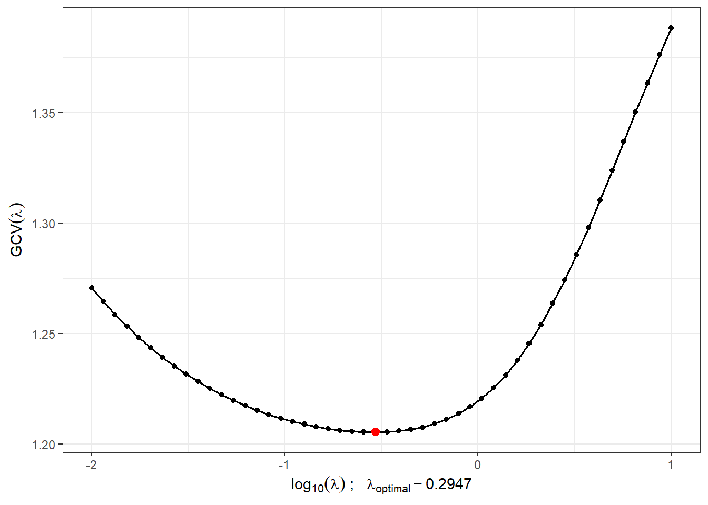
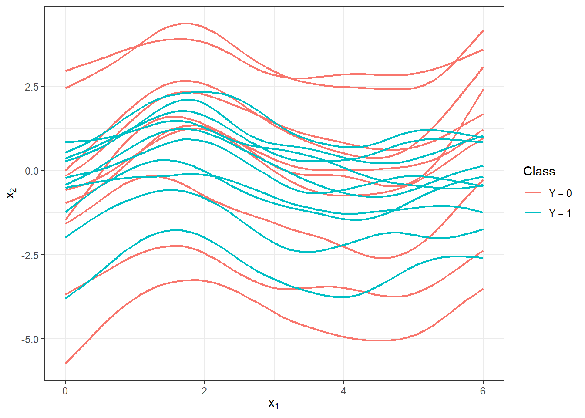
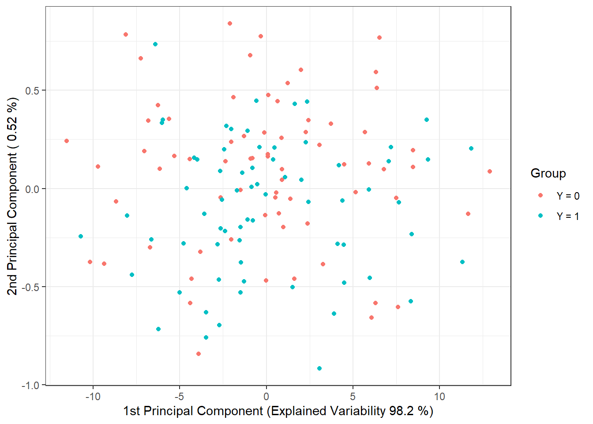
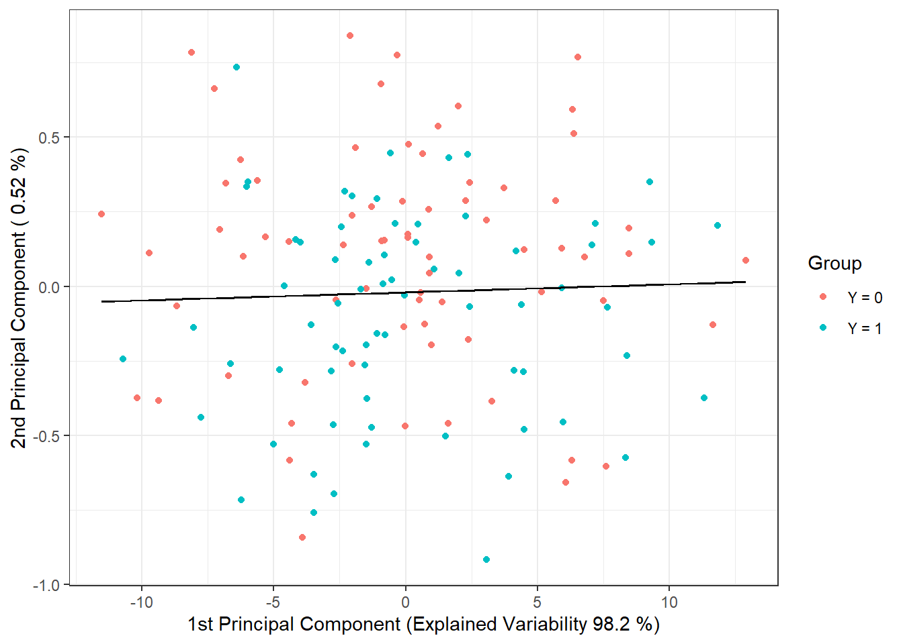
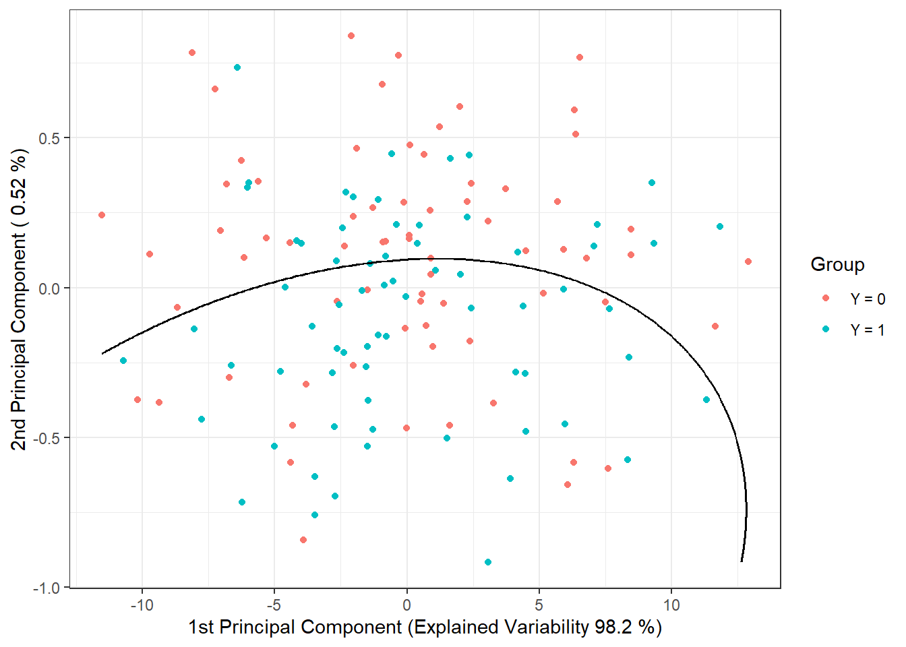
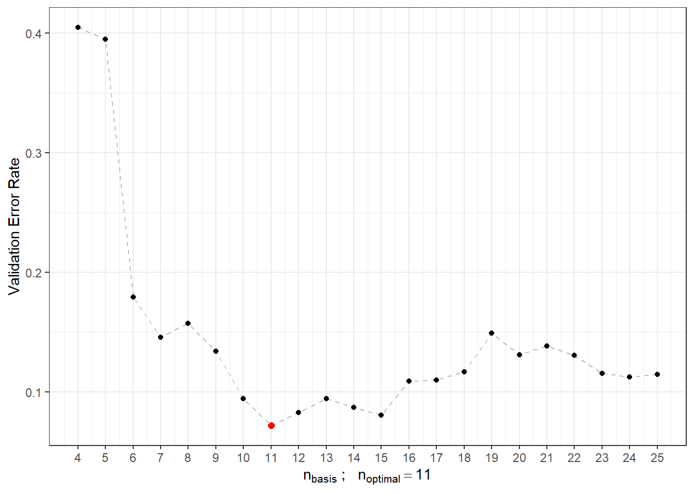

# Dependence on parameter $\sigma_{shift}$ {#simulace3shift}

In this section, we will focus on the dependence of the results from section \@ref(simulace3) on the value of $\sigma^2_{shift}$, which defines the variance of the normal distribution from which we generate the shift for the generated curves. We expect that as the value of $\sigma^2_{shift}$ increases, the results of the individual methods will deteriorate, and thus the classification will not be as successful. We assume that methods utilizing the functional nature of the data will be more successful compared to classical methods as the value of $\sigma^2_{shift}$ increases. In the previous section \@ref(simulace3sigma), we examined the dependence of results on the value of $\sigma^2$, that is, on the variance of the normal distribution from which we generate random errors around the generating curves.

## Simulation of Functional Data

First, we will simulate functions that we will subsequently want to classify. For simplicity, we will consider two classification classes. For the simulation, we will first:

-   choose suitable functions,

-   generate points from the chosen interval, which include, for example, Gaussian noise,

-   smooth the obtained discrete points into the form of a functional object using some suitable basis system.

With this approach, we will obtain functional objects along with the value of the categorical variable $Y$, which distinguishes the membership in the classification class.


``` r
# Load necessary packages

library(fda)
library(ggplot2)
library(dplyr)
library(tidyr)
library(ddalpha)
library(polynom)

set.seed(42)
```

Let us consider two classification classes, $Y \in \{0, 1\}$, with the same number of `n` generated functions for each class. First, we define two functions, each corresponding to one class. The functions will be considered on the interval $I = [0, 6]$.

Now we will create the functions using interpolation polynomials. First, we define the points through which our curve will pass and subsequently fit an interpolation polynomial through these points, which we will use for generating curves for classification.


``` r
# Defining points for class 0
x.0 <- c(0.00, 0.65, 0.94, 1.42, 2.26, 2.84, 3.73, 4.50, 5.43, 6.00)
y.0 <- c(0, 0.25, 0.86, 1.49, 1.1, 0.15, -0.11, -0.36, 0.23, 0)

# Defining points for class 1
x.1 <- c(0.00, 0.51, 0.91, 1.25, 1.51, 2.14, 2.43, 2.96, 3.70, 4.60,
         5.25, 5.67, 6.00)
y.1 <- c(0.1, 0.4, 0.71, 1.08, 1.47, 1.39, 0.81, 0.05, -0.1, -0.4,
         0.3, 0.37, 0)
```


``` r
# Graph of the points
dat_points <- data.frame(x = c(x.0, x.1),
                         y = c(y.0, y.1),
                         Class = rep(c('Y = 0', 'Y = 1'), 
                                     c(length(x.0), length(x.1))))

ggplot(dat_points, aes(x = x, y = y, colour = Class)) + 
  geom_point(size=1.5) + 
  theme_bw() + 
  labs(colour = 'Class')
```

<div class="figure">

<p class="caption">(\#fig:unnamed-chunk-3)Points that define the interpolation polynomials.</p>
</div>

To calculate the interpolation polynomials, we will use the `poly.calc()` function from the `polynom` library. We will also define functions `poly.0()` and `poly.1()`, which will compute the polynomial values at a given point in the interval. To create them, we will use the `predict()` function, to which we will input the respective polynomial and the point at which we want to evaluate the polynomial.


``` r
# Calculation of the polynomials
polynom.0 <- poly.calc(x.0, y.0)
polynom.1 <- poly.calc(x.1, y.1)
```


``` r
poly.0 <- function(x) return(predict(polynom.0, x))
poly.1 <- function(x) return(predict(polynom.1, x))
```


``` r
# Plotting the polynomial
xx <- seq(min(x.0), max(x.0), length = 501)
yy.0 <- poly.0(xx)
yy.1 <- poly.1(xx)

dat_poly_plot <- data.frame(x = c(xx, xx),
                            y = c(yy.0, yy.1),
                            Class = rep(c('Y = 0', 'Y = 1'), 
                                        c(length(xx), length(xx))))

ggplot(dat_points, aes(x = x, y = y, colour = Class)) + 
  geom_point(size=1.5) + 
  theme_bw() + 
  geom_line(data = dat_poly_plot,
            aes(x = x, y = y, colour = Class),
            linewidth = 0.8) + 
  labs(colour = 'Class')
```

<div class="figure">

<p class="caption">(\#fig:unnamed-chunk-6)Representation of two functions over the interval $I = [0, 6]$, from which we generate observations from classes 0 and 1.</p>
</div>


``` r
# Generating functions for Y = 0 and Y = 1
funkce_0 <- poly.0
funkce_1 <- poly.1
```


Now we will create a function to generate random functions with added noise (or points on a predetermined grid) from the chosen generating function. The argument `t` represents the vector of values at which we want to evaluate the given functions, `fun` denotes the generating function, `n` is the number of functions, and `sigma` is the standard deviation $\sigma$ of the normal distribution $\text{N}(\mu, \sigma^2)$, from which we randomly generate Gaussian white noise with $\mu = 0$. To demonstrate the advantage of using methods that work with functional data, we will also add a random term during generation to each simulated observation, which will serve as the vertical shift of the entire function (parameter `sigma_shift`). This shift will be generated from a normal distribution with the parameter $\sigma^2 = 4$.


``` r
generate_values <- function(t, fun, n, sigma, sigma_shift = 0) {
  # Arguments:
  # t ... vector of values, where the function will be evaluated
  # fun ... generating function of t 
  # n ... the number of generated functions / objects
  # sigma ... standard deviation of normal distribution to add noise to data
  # sigma_shift ... parameter of normal distribution for generating shift
  
  # Value:
  # X ... matrix of dimension length(t) times n with generated values of one 
  # function in a column 
  
  X <- matrix(rep(t, times = n), ncol = n, nrow = length(t), byrow = FALSE)
  noise <- matrix(rnorm(n * length(t), mean = 0, sd = sigma),
                  ncol = n, nrow = length(t), byrow = FALSE)
  shift <- matrix(rep(rnorm(n, 0, sigma_shift), each = length(t)),
                  ncol = n, nrow = length(t))
  return(fun(X) + noise + shift)
}
```

Now we can generate the functions. In each of the two classes, we will consider 100 observations, so `n = 100`.


``` r
# Number of generated observations for each class
n <- 100
# Vector of time evenly spaced over the interval [0, 6]
t <- seq(0, 6, length = 51)

# For Y = 0
X0 <- generate_values(t, funkce_0, n, 1, 2)
# For Y = 1
X1 <- generate_values(t, funkce_1, n, 1, 2)
```

We will plot the generated (not yet smoothed) functions color-coded by class (only the first 10 observations from each class for clarity).


``` r
n_curves_plot <- 10 # Number of curves we want to plot from each group

DF0 <- cbind(t, X0[, 1:n_curves_plot]) |> 
  as.data.frame() |> 
  reshape(varying = 2:(n_curves_plot + 1), direction = 'long', sep = '') |> 
  subset(select = -id) |> 
  mutate(
  time = time - 1,
  group = 0
  )

DF1 <- cbind(t, X1[, 1:n_curves_plot]) |> 
  as.data.frame() |> 
  reshape(varying = 2:(n_curves_plot + 1), direction = 'long', sep = '') |> 
  subset(select = -id) |> 
  mutate(
  time = time - 1,
  group = 1
  )

DF <- rbind(DF0, DF1) |>
  mutate(group = factor(group))

DF |> ggplot(aes(x = t, y = V, group = interaction(time, group), 
                 colour = group)) + 
  geom_line(linewidth = 0.5) +
  theme_bw() +
  labs(x = expression(x[1]),
       y = expression(x[2]),
       colour = 'Class') +
  scale_colour_discrete(labels=c('Y = 0', 'Y = 1'))
```

<div class="figure">

<p class="caption">(\#fig:unnamed-chunk-11)First 10 generated observations from each of the two classification classes. The observed data are not smoothed.</p>
</div>

## Smoothing the Observed Curves

Now we will convert the observed discrete values (vectors of values) into functional objects, with which we will subsequently work. We will again use the B-spline basis for smoothing.

We will take the entire vector `t` as the knots and typically consider cubic splines, so we choose (the implicit choice in `R`) `norder = 4`. We will penalize the second derivative of the functions.


``` r
rangeval <- range(t)
breaks <- t
norder <- 4

bbasis <- create.bspline.basis(rangeval = rangeval, 
                               norder = norder, 
                               breaks = breaks)

curv.Lfd <- int2Lfd(2) # Penalizing the 2nd derivative
```

We will find a suitable value for the smoothing parameter $\lambda > 0$ using $GCV(\lambda)$, that is, through generalized cross-validation. We will consider the value of $\lambda$ to be the same for both classification groups, as for test observations we would not know in advance which value of $\lambda, in the case of different choices for each class, we should choose.


``` r
# Combining observations into one matrix
XX <- cbind(X0, X1)

lambda.vect <- 10^seq(from = -2, to = 1, length.out = 50) # Vector of lambdas
gcv <- rep(NA, length = length(lambda.vect)) # Empty vector to store GCV

for(index in 1:length(lambda.vect)) {
  curv.Fdpar <- fdPar(bbasis, curv.Lfd, lambda.vect[index])
  BSmooth <- smooth.basis(t, XX, curv.Fdpar) # Smoothing
  gcv[index] <- mean(BSmooth$gcv) # Average over all observed curves
}

GCV <- data.frame(
  lambda = round(log10(lambda.vect), 3),
  GCV = gcv
)

# Finding the value of the minimum
lambda.opt <- lambda.vect[which.min(gcv)]
```

For better visualization, we will plot the progression of $GCV(\lambda)$.


``` r
GCV |> ggplot(aes(x = lambda, y = GCV)) + 
  geom_line(linetype = 'solid', linewidth = 0.6) + 
  geom_point(size = 1.5) + 
  theme_bw() + 
  labs(x = bquote(paste(log[10](lambda), ' ;   ', 
                        lambda[optimal] == .(round(lambda.opt, 4)))),
       y = expression(GCV(lambda))) + 
  geom_point(aes(x = log10(lambda.opt), y = min(gcv)), colour = 'red', size = 2.5)
```

```
## Warning in geom_point(aes(x = log10(lambda.opt), y = min(gcv)), colour = "red", : All aesthetics have length 1, but the data has 50 rows.
## ℹ Please consider using `annotate()` or provide this layer with data containing
##   a single row.
```

<div class="figure">

<p class="caption">(\#fig:unnamed-chunk-14)The progression of $GCV(\lambda)$ for the selected vector $\boldsymbol\lambda$. The values on the x-axis are plotted on a logarithmic scale. The optimal value of the smoothing parameter $\lambda_{optimal}$ is shown in red.</p>
</div>

With this optimal choice of the smoothing parameter $\lambda$, we will now smooth all functions and again graphically represent the first 10 observed curves from each classification class.


``` r
curv.fdPar <- fdPar(bbasis, curv.Lfd, lambda.opt)
BSmooth <- smooth.basis(t, XX, curv.fdPar)
XXfd <- BSmooth$fd

fdobjSmootheval <- eval.fd(fdobj = XXfd, evalarg = t)
DF$Vsmooth <- c(fdobjSmootheval[, c(1 : n_curves_plot, 
                                    (n + 1) : (n + n_curves_plot))])

DF |> ggplot(aes(x = t, y = Vsmooth, group = interaction(time, group), 
                 colour = group)) + 
  geom_line(linewidth = 0.75) +
  theme_bw() +
  labs(x = expression(x[1]),
       y = expression(x[2]),
       colour = 'Class') +
  scale_colour_discrete(labels=c('Y = 0', 'Y = 1'))
```

<div class="figure">

<p class="caption">(\#fig:unnamed-chunk-15)The first 10 smoothed curves from each classification class.</p>
</div>

Let's also display all curves including the average separately for each class.


``` r
DFsmooth <- data.frame(
  t = rep(t, 2 * n),
  time = rep(rep(1:n, each = length(t)), 2),
  Smooth = c(fdobjSmootheval),
  Mean = c(rep(apply(fdobjSmootheval[ , 1 : n], 1, mean), n),
            rep(apply(fdobjSmootheval[ , (n + 1) : (2 * n)], 1, mean), n)),
  group = factor(rep(c(0, 1), each = n * length(t)))
)

DFmean <- data.frame(
  t = rep(t, 2),
  Mean = c(apply(fdobjSmootheval[ , 1 : n], 1, mean), 
            apply(fdobjSmootheval[ , (n + 1) : (2 * n)], 1, mean)),
  group = factor(rep(c(0, 1), each = length(t)))
)

DFsmooth |> ggplot(aes(x = t, y = Smooth, group = interaction(time, group), 
                 colour = group)) + 
  geom_line(linewidth = 0.25, alpha = 0.5) +
  theme_bw() +
  labs(x = expression(x[1]),
       y = expression(x[2]),
       colour = 'Class') +
  scale_colour_discrete(labels = c('Y = 0', 'Y = 1')) + 
  geom_line(aes(x = t, y = Mean, colour = group), 
            linewidth = 1.2, linetype = 'solid') + 
  scale_x_continuous(expand = c(0.01, 0.01)) + 
  #ylim(c(-1, 2)) + 
  scale_y_continuous(expand = c(0.01, 0.01))#, limits = c(-1, 2))
```

<div class="figure">

<p class="caption">(\#fig:unnamed-chunk-16)Plot of all smoothed observed curves, colored according to their classification class. The thick line represents the mean for each class.</p>
</div>


``` r
DFsmooth <- data.frame(
  t = rep(t, 2 * n),
  time = rep(rep(1:n, each = length(t)), 2),
  Smooth = c(fdobjSmootheval),
  Mean = c(rep(apply(fdobjSmootheval[ , 1 : n], 1, mean), n),
            rep(apply(fdobjSmootheval[ , (n + 1) : (2 * n)], 1, mean), n)),
  group = factor(rep(c(0, 1), each = n * length(t)))
)

DFmean <- data.frame(
  t = rep(t, 2),
  Mean = c(apply(fdobjSmootheval[ , 1 : n], 1, mean), 
            apply(fdobjSmootheval[ , (n + 1) : (2 * n)], 1, mean)),
  group = factor(rep(c(0, 1), each = length(t)))
)

DFsmooth |> ggplot(aes(x = t, y = Smooth, group = interaction(time, group), 
                 colour = group)) + 
  geom_line(linewidth = 0.25, alpha = 0.5) +
  theme_bw() +
  labs(x = expression(x[1]),
       y = expression(x[2]),
       colour = 'Class') +
  scale_colour_discrete(labels = c('Y = 0', 'Y = 1')) + 
  geom_line(aes(x = t, y = Mean, colour = group), 
            linewidth = 1.2, linetype = 'solid') + 
  scale_x_continuous(expand = c(0.01, 0.01)) + 
  #ylim(c(-1, 2)) + 
  scale_y_continuous(expand = c(0.01, 0.01), limits = c(-1, 2))
```

<div class="figure">

<p class="caption">(\#fig:unnamed-chunk-17)Plot of all smoothed observed curves, colored according to their classification class. The thick line represents the mean for each class. Zoomed-in view.</p>
</div>

## Classification of Curves

First, we will load the necessary libraries for classification.


``` r
library(caTools) # for splitting into test and training sets
library(caret) # for k-fold CV
library(fda.usc) # for KNN, fLR
library(MASS) # for LDA
library(fdapace)
library(pracma)
library(refund) # for LR on scores
library(nnet) # for LR on scores
library(caret)
library(rpart) # for decision trees
library(rattle) # for visualization
library(e1071)
library(randomForest) # for random forests
```

To compare the individual classifiers, we will split the generated observation set into two parts in a 70:30 ratio, specifically for training and test (validation) sets. The training set will be used for constructing the classifier, while the test set will be used for calculating classification error and potentially other characteristics of our model. The resulting classifiers can then be compared based on these calculated characteristics in terms of their classification success.


``` r
# Splitting into test and training sets
split <- sample.split(XXfd$fdnames$reps, SplitRatio = 0.7)

Y <- rep(c(0, 1), each = n)

X.train <- subset(XXfd, split == TRUE)
X.test <- subset(XXfd, split == FALSE)

Y.train <- subset(Y, split == TRUE)
Y.test <- subset(Y, split == FALSE)
```

Next, we will examine the representation of individual groups in the test and training parts of the data.


``` r
# Absolute representation
table(Y.train)
```

```
## Y.train
##  0  1 
## 71 69
```

``` r
table(Y.test)
```

```
## Y.test
##  0  1 
## 29 31
```

``` r
# Relative representation
table(Y.train) / sum(table(Y.train))
```

```
## Y.train
##         0         1 
## 0.5071429 0.4928571
```

``` r
table(Y.test) / sum(table(Y.test))
```

```
## Y.test
##         0         1 
## 0.4833333 0.5166667
```

### $K$ Nearest Neighbors

We will start with a non-parametric classification method, the $K$ nearest neighbors method. First, we will create the necessary objects so that we can further work with them using the `classif.knn()` function from the `fda.usc` library.


``` r
x.train <- fdata(X.train)
y.train <- as.numeric(factor(Y.train))
```

Now we can define the model and examine its classification success. The last question remains how to choose the optimal number of neighbors $K$. We could select $K$ that minimizes the error rate on the training data. However, this could lead to overfitting the model; therefore, we will use cross-validation. Given the computational complexity and the size of the dataset, we will choose $k$-fold CV, for instance, with $k = 10$.


``` r
# Model for all training data for K = 1, 2, ..., sqrt(n_train)
neighb.model <- classif.knn(group = y.train, 
                            fdataobj = x.train, 
                            knn = c(1:round(sqrt(length(y.train))))) 

# summary(neighb.model) # summary of the model
# plot(neighb.model$gcv, pch = 16) # plot the dependence of GCV on the number of neighbors K
# neighb.model$max.prob # maximum accuracy
(K.opt <- neighb.model$h.opt) # optimal value of K
```

```
## [1] 5
```

Let’s follow the previous procedure for the training data, which we will split into $k$ parts and repeat this code $k$ times.


``` r
k_cv <- 10 # k-fold CV
neighbours <- c(1:(2 * ceiling(sqrt(length(y.train))))) # number of neighbors 

# Split training data into k parts
folds <- createMultiFolds(X.train$fdnames$reps, k = k_cv, time = 1)

# Empty matrix to store individual results
# Columns will contain accuracy values for the given part of the training set
# Rows will contain values for each neighbor value K
CV.results <- matrix(NA, nrow = length(neighbours), ncol = k_cv)

for (index in 1:k_cv) {
  # Define the specific index set
  fold <- folds[[index]]
    
  x.train.cv <- subset(X.train, c(1:length(X.train$fdnames$reps)) %in% fold) |>
    fdata()
  y.train.cv <- subset(Y.train, c(1:length(X.train$fdnames$reps)) %in% fold) |>
    factor() |> as.numeric()
  
  x.test.cv <- subset(X.train, !c(1:length(X.train$fdnames$reps)) %in% fold) |>
    fdata()
  y.test.cv <- subset(Y.train, !c(1:length(X.train$fdnames$reps)) %in% fold) |>
    factor() |> as.numeric()
  
  # Loop through each part ... repeat k times
  for(neighbour in neighbours) {
    # Model for a specific choice of K
    neighb.model <- classif.knn(group = y.train.cv, 
                              fdataobj = x.train.cv, 
                              knn = neighbour) 
    # Prediction on the validation part
    model.neighb.predict <- predict(neighb.model, 
                                    new.fdataobj = x.test.cv)
    # Accuracy on the validation part
    accuracy <- table(y.test.cv, model.neighb.predict) |> 
      prop.table() |> diag() |> sum()
    
    # Store accuracy at the position for given K and fold
    CV.results[neighbour, index] <- accuracy
  }
}

# Calculate average accuracy for each K across folds
CV.results <- apply(CV.results, 1, mean)
K.opt <- which.max(CV.results)
accuracy.opt.cv <- max(CV.results)
# CV.results
```

We can see that the optimal parameter $K$ is 5 with an error rate calculated using 10-fold CV of 0.3429. For clarity, let's also plot the validation error as a function of the number of neighbors $K$.


``` r
CV.results <- data.frame(K = neighbours, CV = CV.results)
CV.results |> ggplot(aes(x = K, y = 1 - CV)) + 
  geom_line(linetype = 'dashed', colour = 'grey') + 
  geom_point(size = 1.5) + 
  geom_point(aes(x = K.opt, y = 1 - accuracy.opt.cv), colour = 'red', size = 2) +
  theme_bw() + 
  labs(x = bquote(paste(K, ' ;   ', 
                        K[optimal] == .(K.opt))),
       y = 'Validation Error') + 
  scale_x_continuous(breaks = neighbours)
```

```
## Warning in geom_point(aes(x = K.opt, y = 1 - accuracy.opt.cv), colour = "red", : All aesthetics have length 1, but the data has 24 rows.
## ℹ Please consider using `annotate()` or provide this layer with data containing
##   a single row.
```

<div class="figure">

<p class="caption">(\#fig:unnamed-chunk-24)Dependence of validation error on the value of $K$, i.e., on the number of neighbors.</p>
</div>

Now that we know the optimal value of the parameter $K$, we can build the final model.


``` r
neighb.model <- classif.knn(group = y.train, fdataobj = x.train, knn = K.opt)

# Predictions
model.neighb.predict <- predict(neighb.model, 
                                new.fdataobj = fdata(X.test))

# summary(neighb.model)

# Accuracy on test data
accuracy <- table(as.numeric(factor(Y.test)), model.neighb.predict) |>
  prop.table() |>
  diag() |>
  sum()
# Error rate
# 1 - accuracy
```

Thus, we see that the error rate of the model constructed using the $K$ nearest neighbors method with the optimal choice $K_{optimal}$ equal to 5, which we determined through cross-validation, is 0.3571 on the training data and 0.3833 on the test data.

To compare the individual models, we can use both types of error rates. For clarity, we will store them in a table.


``` r
RESULTS <- data.frame(model = 'KNN', 
                      Err.train = 1 - neighb.model$max.prob,
                      Err.test = 1 - accuracy)
```

### Linear Discriminant Analysis

As the second method for constructing a classifier, we will consider Linear Discriminant Analysis (LDA). Since this method cannot be applied directly to functional data, we first need to discretize it using Functional Principal Component Analysis (FPCA). The classification algorithm will then be performed on the scores of the first $p$ principal components. We will choose the number of components $p$ such that the first $p$ principal components together explain at least 90% of the variability in the data.

Let’s first perform the functional principal component analysis and determine the number $p$.


``` r
# Principal component analysis
data.PCA <- pca.fd(X.train, nharm = 10) # nharm - maximum number of principal components
nharm <- which(cumsum(data.PCA$varprop) >= 0.9)[1] # determine p
if(nharm == 1) nharm <- 2

data.PCA <- pca.fd(X.train, nharm = nharm) 
data.PCA.train <- as.data.frame(data.PCA$scores) # scores of the first p principal components
data.PCA.train$Y <- factor(Y.train) # membership to classes
```

In this specific case, we have taken the number of principal components as $p$ = 2, which together explain 98.72 % of the variability in the data. The first principal component explains 98.2 % and the second 0.52 % of the variability. We can graphically display the scores of the first two principal components, color-coded by classification class membership.


``` r
data.PCA.train |> ggplot(aes(x = V1, y = V2, colour = Y)) +
  geom_point(size = 1.5) + 
  labs(x = paste('1st Principal Component (Explained Variability', 
                 round(100 * data.PCA$varprop[1], 2), '%)'),
       y = paste('2nd Principal Component (', 
                 round(100 * data.PCA$varprop[2], 2), '%)'),
       colour = 'Group') +
  scale_colour_discrete(labels = c('Y = 0', 'Y = 1')) +
  theme_bw()
```

<div class="figure">

<p class="caption">(\#fig:unnamed-chunk-28)Scores of the first two principal components for the training data. Points are color-coded based on class membership.</p>
</div>

To determine the classification accuracy on the test data, we need to compute the scores for the first 2 principal components for the test data. These scores can be calculated using the formula:

$$
\xi_{i, j} = \int \left( X_i(t) - \mu(t)\right) \cdot \rho_j(t)\text dt,
$$ 

where $\mu(t)$ is the mean function (average function) and $\rho_j(t)$ is the eigenfunction (functional principal component).


``` r
# Calculate scores for the test functions
scores <- matrix(NA, ncol = nharm, nrow = length(Y.test)) # empty matrix 

for(k in 1:dim(scores)[1]) {
  xfd = X.test[k] - data.PCA$meanfd[1] # k-th observation - mean function
  scores[k, ] = inprod(xfd, data.PCA$harmonics) 
  # scalar product of the residual and eigenfunctions rho (functional principal components)
}

data.PCA.test <- as.data.frame(scores)
data.PCA.test$Y <- factor(Y.test)
colnames(data.PCA.test) <- colnames(data.PCA.train) 
```

Now we can construct a classifier on the training portion of the data.


``` r
# Model
clf.LDA <- lda(Y ~ ., data = data.PCA.train)

# Accuracy on training data
predictions.train <- predict(clf.LDA, newdata = data.PCA.train)
presnost.train <- table(data.PCA.train$Y, predictions.train$class) |>
  prop.table() |> diag() |> sum()

# Accuracy on test data
predictions.test <- predict(clf.LDA, newdata = data.PCA.test)
presnost.test <- table(data.PCA.test$Y, predictions.test$class) |>
  prop.table() |> diag() |> sum()
```

We have calculated the error rate of the classifier on the training data (41.43 %) as well as on the test data (40 %).

To visually illustrate the method, we can mark the decision boundary in the plot of the scores of the first two principal components. We will compute this boundary on a dense grid of points and display it using the `geom_contour()` function.


``` r
# Add decision boundary
np <- 1001 # number of grid points
# x-axis ... 1st PC
nd.x <- seq(from = min(data.PCA.train$V1), 
            to = max(data.PCA.train$V1), length.out = np)
# y-axis ... 2nd PC
nd.y <- seq(from = min(data.PCA.train$V2), 
            to = max(data.PCA.train$V2), length.out = np)
# case for 2 PCs ... p = 2
nd <- expand.grid(V1 = nd.x, V2 = nd.y)
# if p = 3
if(dim(data.PCA.train)[2] == 4) {
  nd <- expand.grid(V1 = nd.x, V2 = nd.y, V3 = data.PCA.train$V3[1])}
# if p = 4
if(dim(data.PCA.train)[2] == 5) {
  nd <- expand.grid(V1 = nd.x, V2 = nd.y, V3 = data.PCA.train$V3[1],
                    V4 = data.PCA.train$V4[1])}
# if p = 5
if(dim(data.PCA.train)[2] == 6) {
  nd <- expand.grid(V1 = nd.x, V2 = nd.y, V3 = data.PCA.train$V3[1],
                    V4 = data.PCA.train$V4[1], V5 = data.PCA.train$V5[1])}

# Add Y = 0, 1
nd <- nd |> mutate(prd = as.numeric(predict(clf.LDA, newdata = nd)$class))

data.PCA.train |> ggplot(aes(x = V1, y = V2, colour = Y)) +
  geom_point(size = 1.5) + 
  labs(x = paste('1st Principal Component (Explained Variability', 
                 round(100 * data.PCA$varprop[1], 2), '%)'),
       y = paste('2nd Principal Component (', 
                 round(100 * data.PCA$varprop[2], 2), '%)'),
       colour = 'Group') +
  scale_colour_discrete(labels = c('Y = 0', 'Y = 1')) +
  theme_bw() +
  geom_contour(data = nd, aes(x = V1, y = V2, z = prd), colour = 'black')
```

<div class="figure">

<p class="caption">(\#fig:unnamed-chunk-31)Scores of the first two principal components, color-coded according to class membership. The decision boundary (line in the plane of the first two principal components) between the classes constructed using LDA is shown in black.</p>
</div>

We observe that the decision boundary is a line, a linear function in 2D space, which we expected from LDA. Finally, we will add the error rates to the summary table.


``` r
Res <- data.frame(model = 'LDA', 
                  Err.train = 1 - presnost.train,
                  Err.test = 1 - presnost.test)

RESULTS <- rbind(RESULTS, Res)
```

### Quadratic Discriminant Analysis

Next, let's construct a classifier using Quadratic Discriminant Analysis (QDA). This is an analogous case to LDA, with the difference that we now allow for different covariance matrices of the normal distribution for each class from which the corresponding scores originate. This dropped assumption of equal covariance matrices leads to a quadratic boundary between classes.

In `R`, QDA is performed similarly to LDA in the previous section, meaning we would again calculate scores for both training and test functions using functional principal component analysis. We will construct the classifier on the scores of the first $p$ principal components and use it to predict the class membership of the test curves as $Y^* \in \{0, 1\}$.

We do not need to perform functional PCA; we will use the results from the LDA section.


We can now proceed directly to constructing the classifier using the `qda()` function. Subsequently, we will calculate the accuracy of the classifier on the test and training data.


``` r
# Model
clf.QDA <- qda(Y ~ ., data = data.PCA.train)

# Accuracy on training data
predictions.train <- predict(clf.QDA, newdata = data.PCA.train)
presnost.train <- table(data.PCA.train$Y, predictions.train$class) |>
  prop.table() |> diag() |> sum()
  
# Accuracy on test data
predictions.test <- predict(clf.QDA, newdata = data.PCA.test)
presnost.test <- table(data.PCA.test$Y, predictions.test$class) |>
  prop.table() |> diag() |> sum()
```

Thus, we have calculated the error rate of the classifier on the training data (35.71 %) as well as on the test data (40 %).

To visually illustrate the method, we can mark the decision boundary in the plot of the scores of the first two principal components. We will compute this boundary on a dense grid of points and display it using the `geom_contour()` function, just like in the case of LDA.


``` r
nd <- nd |> mutate(prd = as.numeric(predict(clf.QDA, newdata = nd)$class))

data.PCA.train |> ggplot(aes(x = V1, y = V2, colour = Y)) +
  geom_point(size = 1.5) + 
  labs(x = paste('1st Principal Component (Explained Variability', 
                 round(100 * data.PCA$varprop[1], 2), '%)'),
       y = paste('2nd Principal Component (', 
                 round(100 * data.PCA$varprop[2], 2), '%)'),
       colour = 'Group') +
  scale_colour_discrete(labels = c('Y = 0', 'Y = 1')) +
  theme_bw() +
  geom_contour(data = nd, aes(x = V1, y = V2, z = prd), colour = 'black')
```

<div class="figure">

<p class="caption">(\#fig:unnamed-chunk-37)Scores of the first two principal components, color-coded according to class membership. The decision boundary (parabola in the plane of the first two principal components) between the classes constructed using QDA is shown in black.</p>
</div>

Note that the decision boundary between classification classes is now a parabola.

Finally, we will add the error rates to the summary table.


``` r
Res <- data.frame(model = 'QDA', 
                  Err.train = 1 - presnost.train,
                  Err.test = 1 - presnost.test)

RESULTS <- rbind(RESULTS, Res)
```

### Logistic Regression

Logistic regression can be performed in two ways: 
1. Using the functional analogue of classical logistic regression, 
2. Using classical multidimensional logistic regression applied to the scores of the first $p$ principal components.

#### Functional Logistic Regression

Analogous to the case of finite-dimensional input data, we consider a logistic model in the form:

$$
g\left(\mathbb E [Y|X = x]\right) = \eta (x) = g(\pi(x)) = \alpha + \int \beta(t)\cdot x(t) \text{ d} t,
$$ 

where $\eta(x)$ is a linear predictor taking values in the interval $(-\infty, \infty)$, $g(\cdot)$ is a *link function* (in the case of logistic regression, this is the logit function $g: (0,1) \rightarrow \mathbb R,\ g(p) = \ln\frac{p}{1-p}$), and $\pi(x)$ is the conditional probability:

$$
\pi(x) = \text{Pr}(Y = 1 | X = x) = g^{-1}(\eta(x)) = \frac{\text{e}^{\alpha + \int \beta(t)\cdot x(t) \text{ d} t}}{1 + \text{e}^{\alpha + \int \beta(t)\cdot x(t) \text{ d} t}},
$$

where $\alpha$ is a constant and $\beta(t) \in L^2[a, b]$ is a parameterized function. Our goal is to estimate this parameterized function.

For functional logistic regression, we will use the `fregre.glm()` function from the `fda.usc` package. First, we will create appropriate objects for the construction of the classifier.


``` r
# Create suitable objects
x.train <- fdata(X.train)
y.train <- as.numeric(Y.train)

# Points at which functions are evaluated
tt <- x.train[["argvals"]]

dataf <- as.data.frame(y.train) 
colnames(dataf) <- "Y"
# B-spline basis 
basis1 <- X.train$basis
```

To estimate the parameterized function $\beta(t)$, we need to express it in some basis representation, in our case, a B-spline basis. However, we need to find an appropriate number of basis functions. This could be determined based on the error rate on the training data, but this data would favor the selection of a large number of bases, leading to model overfitting.

Let's illustrate this with the following case. For each number of bases $n_{basis} \in \{4, 5, \dots, 50\}$, we will train a model on the training data, determine the error rate on them, and also calculate the error rate on the test data. Remember, we cannot use the same data to estimate the test error rate, as this would underestimate it.


``` r
n.basis.max <- 50
n.basis <- 4:n.basis.max
pred.baz <- matrix(NA, nrow = length(n.basis), ncol = 2, 
                   dimnames = list(n.basis, c('Err.train', 'Err.test')))

for (i in n.basis) {
  # Basis for betas
  basis2 <- create.bspline.basis(rangeval = range(tt), nbasis = i)
  # Relationship
  f <- Y ~ x
  # Basis for x and betas
  basis.x <- list("x" = basis1) # smoothed data
  basis.b <- list("x" = basis2)
  # Input data for the model
  ldata <- list("df" = dataf, "x" = x.train)
  # Binomial model ... logistic regression model
  model.glm <- fregre.glm(f, family = binomial(), data = ldata,
                          basis.x = basis.x, basis.b = basis.b)
  
  # Accuracy on training data
  predictions.train <- predict(model.glm, newx = ldata)
  predictions.train <- data.frame(Y.pred = ifelse(predictions.train < 1/2, 0, 1))
  presnost.train <- table(Y.train, predictions.train$Y.pred) |>
    prop.table() |> diag() |> sum()
    
  # Accuracy on test data
  newldata = list("df" = as.data.frame(Y.test), "x" = fdata(X.test))
  predictions.test <- predict(model.glm, newx = newldata)
  predictions.test <- data.frame(Y.pred = ifelse(predictions.test < 1/2, 0, 1))
  presnost.test <- table(Y.test, predictions.test$Y.pred) |>
    prop.table() |> diag() |> sum()
  
  # Store in matrix
  pred.baz[as.character(i), ] <- 1 - c(presnost.train, presnost.test)
} 

pred.baz <- as.data.frame(pred.baz)
pred.baz$n.basis <- n.basis
```

Let's illustrate the relationship between both types of error rates in a graph, depending on the number of basis functions.


``` r
n.basis.beta.opt <- pred.baz$n.basis[which.min(pred.baz$Err.test)]

pred.baz |> ggplot(aes(x = n.basis, y = Err.test)) + 
  geom_line(linetype = 'dashed', colour = 'black') + 
  geom_line(aes(x = n.basis, y = Err.train), colour = 'deepskyblue3', 
            linetype = 'dashed', linewidth = 0.5) + 
  geom_point(size = 1.5) + 
  geom_point(aes(x = n.basis, y = Err.train), colour = 'deepskyblue3', 
             size = 1.5) + 
  geom_point(aes(x = n.basis.beta.opt, y = min(pred.baz$Err.test)),
             colour = 'red', size = 2) +
  theme_bw() + 
  labs(x = bquote(paste(n[basis], ' ;   ', 
                        n[optimal] == .(n.basis.beta.opt))),
        y = 'Error Rate')
```

```
## Warning: Use of `pred.baz$Err.test` is discouraged.
## ℹ Use `Err.test` instead.
```

```
## Warning in geom_point(aes(x = n.basis.beta.opt, y = min(pred.baz$Err.test)), : All aesthetics have length 1, but the data has 47 rows.
## ℹ Please consider using `annotate()` or provide this layer with data containing
##   a single row.
```

<div class="figure">

<p class="caption">(\#fig:unnamed-chunk-41)Dependence of test and training error rates on the number of basis functions for $\beta$. The red point indicates the optimal number $n_{optimal}$ chosen as the minimum of the test error rate, the black line represents the test error rate, and the blue dashed line shows the trend of the training error rate.</p>
</div>

As we can see, as the number of basis functions for $\beta(t)$ increases, the training error rate (blue line) tends to decrease, suggesting that we would choose large values of $n_{basis}$ based on this. Conversely, the optimal choice based on the test error rate is $n = 29$, which is significantly smaller than 50. In contrast, as $n$ increases, the test error rate rises, indicating model overfitting.

For these reasons, we will use 10-fold cross-validation to determine the optimal number of basis functions for $\beta(t)$. The maximum number of basis functions considered will be 25, as we observed earlier that exceeding this number leads to model overfitting.


``` r
### 10-fold cross-validation
n.basis.max <- 25
n.basis <- 4:n.basis.max
k_cv <- 10 # k-fold CV
# Split the training data into k parts
folds <- createMultiFolds(X.train$fdnames$reps, k = k_cv, time = 1)
# Unchanging elements during the loop
# Points at which functions are evaluated
tt <- x.train[["argvals"]]
rangeval <- range(tt)
# B-spline basis 
basis1 <- X.train$basis
# Relationship
f <- Y ~ x
# Basis for x
basis.x <- list("x" = basis1)
# Empty matrix to store individual results
# Columns will contain accuracy values for each part of the training set
# Rows will contain values for the given number of bases
CV.results <- matrix(NA, nrow = length(n.basis), ncol = k_cv, 
                     dimnames = list(n.basis, 1:k_cv))
```

Now we are ready to calculate the error rate on each of the ten subsets of the training set. Next, we will determine the average and take the argument of the minimum validation error rate as optimal $n$.


``` r
for (index in 1:k_cv) {
  # Define the given index set
  fold <- folds[[index]]
    
  x.train.cv <- subset(X.train, c(1:length(X.train$fdnames$reps)) %in% fold) |>
    fdata()
  y.train.cv <- subset(Y.train, c(1:length(X.train$fdnames$reps)) %in% fold) |>
    as.numeric()
  
  x.test.cv <- subset(X.train, !c(1:length(X.train$fdnames$reps)) %in% fold) |>
    fdata()
  y.test.cv <- subset(Y.train, !c(1:length(X.train$fdnames$reps)) %in% fold) |>
    as.numeric()
  
  dataf <- as.data.frame(y.train.cv) 
  colnames(dataf) <- "Y"
  
  for (i in n.basis) {
    # Basis for betas
    basis2 <- create.bspline.basis(rangeval = rangeval, nbasis = i)
    
    basis.b <- list("x" = basis2)
    # Input data for the model
    ldata <- list("df" = dataf, "x" = x.train.cv)
    # Binomial model ... logistic regression model
    model.glm <- fregre.glm(f, family = binomial(), data = ldata,
                            basis.x = basis.x, basis.b = basis.b)
    
    # Accuracy on validation part 
    newldata = list("df" = as.data.frame(y.test.cv), "x" = x.test.cv)
    predictions.valid <- predict(model.glm, newx = newldata)
    predictions.valid <- data.frame(Y.pred = ifelse(predictions.valid < 1/2, 0, 1))
    presnost.valid <- table(y.test.cv, predictions.valid$Y.pred) |>
      prop.table() |> diag() |> sum()
    
    # Store in matrix
    CV.results[as.character(i), as.character(index)] <- presnost.valid
  } 
}

# Calculate the average accuracies for each n over folds
CV.results <- apply(CV.results, 1, mean)
n.basis.opt <- n.basis[which.max(CV.results)]
presnost.opt.cv <- max(CV.results)
# CV.results
```

Let’s also plot the validation error rate along with the highlighted optimal value $n_{optimal}$ as 11 with validation error rate 0.072.


``` r
CV.results <- data.frame(n.basis = n.basis, CV = CV.results)
CV.results |> ggplot(aes(x = n.basis, y = 1 - CV)) + 
  geom_line(linetype = 'dashed', colour = 'grey') + 
  geom_point(size = 1.5) + 
  geom_point(aes(x = n.basis.opt, y = 1 - presnost.opt.cv), colour = 'red', size = 2) +
  theme_bw() + 
  labs(x = bquote(paste(n[basis], ' ;   ', 
                        n[optimal] == .(n.basis.opt))),
       y = 'Validation Error Rate') + 
  scale_x_continuous(breaks = n.basis)
```

```
## Warning in geom_point(aes(x = n.basis.opt, y = 1 - presnost.opt.cv), colour = "red", : All aesthetics have length 1, but the data has 22 rows.
## ℹ Please consider using `annotate()` or provide this layer with data containing
##   a single row.
```

<div class="figure">

<p class="caption">(\#fig:unnamed-chunk-44)Dependence of validation error rate on the value of $n_{basis}$, that is, on the number of bases.</p>
</div>

Now we can define the final model using functional logistic regression, choosing a B-spline basis for $\beta(t)$ with 11 bases.


``` r
# optimal model
basis2 <- create.bspline.basis(rangeval = range(tt), nbasis = n.basis.opt)
f <- Y ~ x
# Bases for x and betas
basis.x <- list("x" = basis1) 
basis.b <- list("x" = basis2)
# Input data for the model
dataf <- as.data.frame(y.train) 
colnames(dataf) <- "Y"
ldata <- list("df" = dataf, "x" = x.train)
# Binomial model ... logistic regression model
model.glm <- fregre.glm(f, family = binomial(), data = ldata,
                        basis.x = basis.x, basis.b = basis.b)

# Accuracy on training data
predictions.train <- predict(model.glm, newx = ldata)
predictions.train <- data.frame(Y.pred = ifelse(predictions.train < 1/2, 0, 1))
presnost.train <- table(Y.train, predictions.train$Y.pred) |>
  prop.table() |> diag() |> sum()
  
# Accuracy on test data
newldata = list("df" = as.data.frame(Y.test), "x" = fdata(X.test))
predictions.test <- predict(model.glm, newx = newldata)
predictions.test <- data.frame(Y.pred = ifelse(predictions.test < 1/2, 0, 1))
presnost.test <- table(Y.test, predictions.test$Y.pred) |>
  prop.table() |> diag() |> sum()
```

We have calculated the training error rate (which is 3.57 %) and the test error rate (which is 8.33 %). To better visualize the estimated probabilities of belonging to the classification class $Y = 1$ on the training data in relation to the values of the linear predictor, we can plot:


``` r
data.frame(
  linear.predictor = model.glm$linear.predictors,
  response = model.glm$fitted.values,
  Y = factor(y.train)
) |> ggplot(aes(x = linear.predictor, y = response, colour = Y)) + 
  geom_point(size = 1.5) + 
  scale_colour_discrete(labels = c('Y = 0', 'Y = 1')) +
  geom_abline(aes(slope = 0, intercept = 0.5), linetype = 'dashed') + 
  theme_bw() + 
  labs(x = 'Linear Predictor',
       y = 'Estimated Probabilities Pr(Y = 1|X = x)',
       colour = 'Class') 
```

<div class="figure">

<p class="caption">(\#fig:unnamed-chunk-46)Dependence of estimated probabilities on the values of the linear predictor. Points are color-coded according to class membership.</p>
</div>

We can also visualize the estimated parametric function $\beta(t)$.


``` r
t.seq <- seq(0, 6, length = 1001)
beta.seq <- eval.fd(evalarg = t.seq, fdobj = model.glm$beta.l$x)

data.frame(t = t.seq, beta = beta.seq) |> 
  ggplot(aes(t, beta)) + 
  geom_line() + 
  theme_bw() +
  labs(x = 'Time',
       y = expression(widehat(beta)(t))) + 
  theme(panel.grid.major = element_blank(), panel.grid.minor = element_blank()) + 
  geom_abline(aes(slope = 0, intercept = 0), linetype = 'dashed', 
              linewidth = 0.5, colour = 'grey')
```

<div class="figure">

<p class="caption">(\#fig:unnamed-chunk-47)Plot of the estimated parametric function $\beta(t), t \in [0, 6]$.</p>
</div>

Finally, we will summarize the results in a summary table.


``` r
Res <- data.frame(model = 'LR functional', 
                  Err.train = 1 - presnost.train,
                  Err.test = 1 - presnost.test)

RESULTS <- rbind(RESULTS, Res)
```

### Support Vector Machines

We will define data for the next methods.


``` r
# Sequence of points where we will evaluate the function
t.seq <- seq(0, 6, length = 101)
   
grid.data <- eval.fd(fdobj = X.train, evalarg = t.seq)
grid.data <- as.data.frame(t(grid.data)) # Transpose for functions in rows
grid.data$Y <- Y.train |> factor()

grid.data.test <- eval.fd(fdobj = X.test, evalarg = t.seq)
grid.data.test <- as.data.frame(t(grid.data.test))
grid.data.test$Y <- Y.test |> factor()
```

First, let's define the necessary datasets with coefficients.


``` r
# Training dataset
data.Bbasis.train <- t(X.train$coefs) |> as.data.frame()
data.Bbasis.train$Y <- factor(Y.train)

# Test dataset
data.Bbasis.test <- t(X.test$coefs) |> as.data.frame()
data.Bbasis.test$Y <- factor(Y.test)
```

Now let's look at the classification of our simulated curves using Support Vector Machines (SVM). The advantage of this classification method is its computational efficiency, as it uses only a few observations (often very few) to define the decision boundary between classes.

#### Discretization of the Interval

Let's start by applying the SVM method directly to the discretized data (evaluating the function on a given grid of points in the interval $I = [0, 6]$), considering all three aforementioned kernel functions.


``` r
# Set norm equal to one
norms <- c()
for (i in 1:dim(XXfd$coefs)[2]) {
  norms <- c(norms, as.numeric(1 / norm.fd(XXfd[i])))
}
XXfd_norm <- XXfd 
XXfd_norm$coefs <- XXfd_norm$coefs * matrix(norms, 
                                            ncol = dim(XXfd$coefs)[2],
                                            nrow = dim(XXfd$coefs)[1],
                                            byrow = T)

# Split into training and test sets
X.train_norm <- subset(XXfd_norm, split == TRUE)
X.test_norm <- subset(XXfd_norm, split == FALSE)

Y.train_norm <- subset(Y, split == TRUE)
Y.test_norm <- subset(Y, split == FALSE)

grid.data <- eval.fd(fdobj = X.train_norm, evalarg = t.seq)
grid.data <- as.data.frame(t(grid.data)) 
grid.data$Y <- Y.train_norm |> factor()

grid.data.test <- eval.fd(fdobj = X.test_norm, evalarg = t.seq)
grid.data.test <- as.data.frame(t(grid.data.test))
grid.data.test$Y <- Y.test_norm |> factor()
```


``` r
# Build models
clf.SVM.l <- svm(Y ~ ., data = grid.data,
                 type = 'C-classification',
                 scale = TRUE,
                 cost = 100,
                 kernel = 'linear')

clf.SVM.p <- svm(Y ~ ., data = grid.data,
                 type = 'C-classification',
                 scale = TRUE,
                 coef0 = 1,
                 cost = 100,
                 kernel = 'polynomial')

clf.SVM.r <- svm(Y ~ ., data = grid.data,
                 type = 'C-classification',
                 scale = TRUE,
                 cost = 100000,
                 gamma = 0.0001,
                 kernel = 'radial')

# Accuracy on training data
predictions.train.l <- predict(clf.SVM.l, newdata = grid.data)
presnost.train.l <- table(Y.train, predictions.train.l) |>
  prop.table() |> diag() |> sum()

predictions.train.p <- predict(clf.SVM.p, newdata = grid.data)
presnost.train.p <- table(Y.train, predictions.train.p) |>
  prop.table() |> diag() |> sum()

predictions.train.r <- predict(clf.SVM.r, newdata = grid.data)
presnost.train.r <- table(Y.train, predictions.train.r) |>
  prop.table() |> diag() |> sum()

# Accuracy on test data
predictions.test.l <- predict(clf.SVM.l, newdata = grid.data.test)
presnost.test.l <- table(Y.test, predictions.test.l) |>
  prop.table() |> diag() |> sum()

predictions.test.p <- predict(clf.SVM.p, newdata = grid.data.test)
presnost.test.p <- table(Y.test, predictions.test.p) |>
  prop.table() |> diag() |> sum()

predictions.test.r <- predict(clf.SVM.r, newdata = grid.data.test)
presnost.test.r <- table(Y.test, predictions.test.r) |>
  prop.table() |> diag() |> sum()
```

The error rate of the SVM method on the training data is thus 5.71 % for the linear kernel, 2.14 % for the polynomial kernel, and 3.57 % for the radial kernel. On the test data, the error rate is 16.67 % for the linear kernel, 16.67 % for the polynomial kernel, and 13.33 % for the radial kernel.


``` r
Res <- data.frame(model = c('SVM linear - discretized', 
                            'SVM polynomial - discretized', 
                            'SVM RBF - discretized'), 
                  Err.train = 1 - c(presnost.train.l, presnost.train.p, presnost.train.r),
                  Err.test = 1 - c(presnost.test.l, presnost.test.p, presnost.test.r))

RESULTS <- rbind(RESULTS, Res)
```

### Principal Component Scores

In this case, we will use the scores of the first $p =$ 2 principal components.


``` r
# Model building
clf.SVM.l.PCA <- svm(Y ~ ., data = data.PCA.train,
                     type = 'C-classification',
                     scale = TRUE,
                     cost = 0.01,
                     kernel = 'linear')

clf.SVM.p.PCA <- svm(Y ~ ., data = data.PCA.train,
                     type = 'C-classification',
                     scale = TRUE,
                     coef0 = 1,
                     cost = 0.6,
                     kernel = 'polynomial')

clf.SVM.r.PCA <- svm(Y ~ ., data = data.PCA.train,
                     type = 'C-classification',
                     scale = TRUE,
                     cost = 1000,
                     gamma = 0.01,
                     kernel = 'radial')

# Accuracy on training data
predictions.train.l <- predict(clf.SVM.l.PCA, newdata = data.PCA.train)
presnost.train.l <- table(data.PCA.train$Y, predictions.train.l) |>
  prop.table() |> diag() |> sum()

predictions.train.p <- predict(clf.SVM.p.PCA, newdata = data.PCA.train)
presnost.train.p <- table(data.PCA.train$Y, predictions.train.p) |>
  prop.table() |> diag() |> sum()

predictions.train.r <- predict(clf.SVM.r.PCA, newdata = data.PCA.train)
presnost.train.r <- table(data.PCA.train$Y, predictions.train.r) |>
  prop.table() |> diag() |> sum()
  
# Accuracy on testing data
predictions.test.l <- predict(clf.SVM.l.PCA, newdata = data.PCA.test)
presnost.test.l <- table(data.PCA.test$Y, predictions.test.l) |>
  prop.table() |> diag() |> sum()

predictions.test.p <- predict(clf.SVM.p.PCA, newdata = data.PCA.test)
presnost.test.p <- table(data.PCA.test$Y, predictions.test.p) |>
  prop.table() |> diag() |> sum()

predictions.test.r <- predict(clf.SVM.r.PCA, newdata = data.PCA.test)
presnost.test.r <- table(data.PCA.test$Y, predictions.test.r) |>
  prop.table() |> diag() |> sum()
```

The error rate of the SVM method applied to the principal component scores on the training data is thus 44.29 % for the linear kernel, 37.86 % for the polynomial kernel, and 37.14 % for the Gaussian kernel. On the testing data, the error rate of the method is 48.33 % for the linear kernel, 43.33 % for the polynomial kernel, and 40 % for the radial kernel.

To graphically represent the method, we can plot the decision boundary on the scores of the first two principal components. We will calculate this boundary on a dense grid of points and display it using the `geom_contour()` function, as done in previous cases when we also plotted classification boundaries.


``` r
nd <- rbind(nd, nd, nd) |> mutate(
   prd = c(as.numeric(predict(clf.SVM.l.PCA, newdata = nd, type = 'response')),
           as.numeric(predict(clf.SVM.p.PCA, newdata = nd, type = 'response')),
           as.numeric(predict(clf.SVM.r.PCA, newdata = nd, type = 'response'))),
   kernel = rep(c('linear', 'polynomial', 'radial'),
                each = length(as.numeric(predict(clf.SVM.l.PCA, 
                                                 newdata = nd,
                                                 type = 'response')))))

data.PCA.train |> ggplot(aes(x = V1, y = V2, colour = Y)) +
 geom_point(size = 1.5) + 
 labs(x = paste('1st Principal Component (explained variability', 
                round(100 * data.PCA$varprop[1], 2), '%)'),
      y = paste('2nd Principal Component (', 
                round(100 * data.PCA$varprop[2], 2), '%)'),
      colour = 'Group', 
      linetype = 'Kernel type') +
 scale_colour_discrete(labels = c('Y = 0', 'Y = 1')) +
 theme_bw() +
 geom_contour(data = nd, aes(x = V1, y = V2, z = prd, linetype = kernel), 
              colour = 'black') + 
 geom_contour(data = nd, aes(x = V1, y = V2, z = prd, linetype = kernel),
              colour = 'black') + 
 geom_contour(data = nd, aes(x = V1, y = V2, z = prd, linetype = kernel),
              colour = 'black')
```

<div class="figure">

<p class="caption">(\#fig:unnamed-chunk-57)Scores of the first two principal components, color-coded according to classification class membership. The decision boundary (line or curves in the plane of the first two principal components) between the classes is marked in black, constructed using the SVM method.</p>
</div>


``` r
Res <- data.frame(model = c('SVM linear - PCA', 
                            'SVM poly - PCA', 
                            'SVM rbf - PCA'), 
                  Err.train = 1 - c(presnost.train.l, presnost.train.p, presnost.train.r),
                  Err.test = 1 - c(presnost.test.l, presnost.test.p, presnost.test.r))

RESULTS <- rbind(RESULTS, Res)
```

#### Base Coefficients

Finally, we will use function representation through B-spline basis.


``` r
# Model building
clf.SVM.l.Bbasis <- svm(Y ~ ., data = data.Bbasis.train,
                        type = 'C-classification',
                        scale = TRUE,
                        cost = 500,
                        kernel = 'linear')

clf.SVM.p.Bbasis <- svm(Y ~ ., data = data.Bbasis.train,
                        type = 'C-classification',
                        scale = TRUE,
                        coef0 = 1,
                        cost = 500,
                        kernel = 'polynomial')

clf.SVM.r.Bbasis <- svm(Y ~ ., data = data.Bbasis.train,
                        type = 'C-classification',
                        scale = TRUE,
                        cost = 1000,
                        gamma = 0.005,
                        kernel = 'radial')

# Accuracy on training data
predictions.train.l <- predict(clf.SVM.l.Bbasis, newdata = data.Bbasis.train)
presnost.train.l <- table(Y.train, predictions.train.l) |>
  prop.table() |> diag() |> sum()

predictions.train.p <- predict(clf.SVM.p.Bbasis, newdata = data.Bbasis.train)
presnost.train.p <- table(Y.train, predictions.train.p) |>
  prop.table() |> diag() |> sum()

predictions.train.r <- predict(clf.SVM.r.Bbasis, newdata = data.Bbasis.train)
presnost.train.r <- table(Y.train, predictions.train.r) |>
  prop.table() |> diag() |> sum()
  
# Accuracy on test data
predictions.test.l <- predict(clf.SVM.l.Bbasis, newdata = data.Bbasis.test)
presnost.test.l <- table(Y.test, predictions.test.l) |>
  prop.table() |> diag() |> sum()

predictions.test.p <- predict(clf.SVM.p.Bbasis, newdata = data.Bbasis.test)
presnost.test.p <- table(Y.test, predictions.test.p) |>
  prop.table() |> diag() |> sum()

predictions.test.r <- predict(clf.SVM.r.Bbasis, newdata = data.Bbasis.test)
presnost.test.r <- table(Y.test, predictions.test.r) |>
  prop.table() |> diag() |> sum()
```

The error rate of the SVM method applied to the base coefficients on the training data is therefore 4.29 % for the linear kernel, 4.29 % for the polynomial kernel, and 7.14 % for the radial kernel. On the test data, the error rate of the method is 10 % for the linear kernel, 11.67 % for the polynomial kernel, and 15 % for the radial kernel.


``` r
Res <- data.frame(model = c('SVM linear - Bbasis', 
                            'SVM poly - Bbasis', 
                            'SVM rbf - Bbasis'), 
                  Err.train = 1 - c(presnost.train.l, presnost.train.p, presnost.train.r),
                  Err.test = 1 - c(presnost.test.l, presnost.test.p, presnost.test.r))

RESULTS <- rbind(RESULTS, Res)
```

#### Projection onto B-Spline Basis

Another way to apply the classical SVM method to functional data is to project the original data onto a $d$-dimensional subspace of our Hilbert space $\mathcal{H}$, which we denote as $V_d$. We assume that this subspace $V_d$ has an orthonormal basis $\{\Psi_j\}_{j = 1, \dots, d}$. We define the transformation $P_{V_d}$ as the orthogonal projection onto the subspace $V_d$, which can be expressed as

$$
P_{V_d} (x) = \sum_{j = 1}^d \langle x, \Psi_j \rangle \Psi_j.
$$

Now, we can use the coefficients from the orthogonal projection for classification, applying standard SVM to the vectors $\left( \langle x, \Psi_1 \rangle, \dots, \langle x, \Psi_d \rangle\right)^\top$. By utilizing this transformation, we have defined a new, so-called adapted kernel, which consists of the orthogonal projection $P_{V_d}$ and the kernel function of the standard support vector method. Thus, we have the (adapted) kernel $Q(x_i, x_j) = K(P_{V_d}(x_i), P_{V_d}(x_j))$. This is a dimensionality reduction method that we can call *filtering*.

For the projection itself, we will use the `project.basis()` function from the `fda` package in `R`. The input will be a matrix of the original discrete (non-smoothed) data, the values at which we measure the values in the original data matrix, and the basis object onto which we want to project the data. We will choose to project onto the B-spline basis since using a Fourier basis is not suitable for our non-periodic data.

The dimension $d$ is either chosen based on prior expert knowledge or through cross-validation. In our case, we will determine the optimal dimension of the subspace $V_d$ using $k$-fold cross-validation (choosing $k \ll n$ due to the computational intensity of the method, often $k = 5$ or $k = 10$). We require B-splines of order 4, and the number of basis functions is determined by the relationship

$$
n_{basis} = n_{breaks} + n_{order} - 2,
$$

where $n_{breaks}$ is the number of knots and $n_{order} = 4$. Therefore, we choose a minimum dimension of $n_{basis} = 3$ (for $n_{breaks} = 1$) and a maximum dimension of $n_{basis} = 53$ (for $n_{breaks} = 51$, corresponding to the number of original discrete data points). However, in `R`, the value of $n_{basis}$ must be at least $n_{order} = 4$, and for large values of $n_{basis}$, overfitting occurs, so we choose a maximum of $n_{basis} = 43$.


``` r
k_cv <- 10 # k-fold CV

# Values for B-spline basis
rangeval <- range(t)
norder <- 4
n_basis_min <- norder
n_basis_max <- length(t) + norder - 2 - 10

dimensions <- n_basis_min:n_basis_max # All dimensions we want to try

# Split training data into k parts
folds <- createMultiFolds(1:sum(split), k = k_cv, time = 1)

# List with three components ... matrices for individual kernels -> linear, poly, radial
# Empty matrix where we will store the results
# Columns will have accuracy values for the respective part of the training set
# Rows will have values for the respective dimension value
CV.results <- list(SVM.l = matrix(NA, nrow = length(dimensions), ncol = k_cv),
                   SVM.p = matrix(NA, nrow = length(dimensions), ncol = k_cv),
                   SVM.r = matrix(NA, nrow = length(dimensions), ncol = k_cv))

for (d in dimensions) {
  # Basis object
  bbasis <- create.bspline.basis(rangeval = rangeval, 
                                 nbasis = d)
  
  # Projection of discrete data onto B-spline basis of dimension d
  Projection <- project.basis(y = XX, # Matrix of discrete data
                              argvals = t, # Vector of arguments
                              basisobj = bbasis) # Basis object
  
  # Split into training and testing data for CV
  XX.train <- subset(t(Projection), split == TRUE)
  
  for (index_cv in 1:k_cv) {
    # Define test and training parts for CV
    fold <- folds[[index_cv]]
    cv_sample <- 1:dim(XX.train)[1] %in% fold
    
    data.projection.train.cv <- as.data.frame(XX.train[cv_sample, ])
    data.projection.train.cv$Y <- factor(Y.train[cv_sample])
    
    data.projection.test.cv <- as.data.frame(XX.train[!cv_sample, ])
    Y.test.cv <- Y.train[!cv_sample]
    data.projection.test.cv$Y <- factor(Y.test.cv)
  
    # Model building
    clf.SVM.l.projection <- svm(Y ~ ., data = data.projection.train.cv,
                            type = 'C-classification',
                            scale = TRUE,
                            kernel = 'linear')
    
    clf.SVM.p.projection <- svm(Y ~ ., data = data.projection.train.cv,
                            type = 'C-classification',
                            scale = TRUE,
                            coef0 = 1,
                            kernel = 'polynomial')
    
    clf.SVM.r.projection <- svm(Y ~ ., data = data.projection.train.cv,
                            type = 'C-classification',
                            scale = TRUE,
                            kernel = 'radial')
      
    # Accuracy on validation data
    ## Linear kernel
    predictions.test.l <- predict(clf.SVM.l.projection,
                                  newdata = data.projection.test.cv)
    presnost.test.l <- table(Y.test.cv, predictions.test.l) |>
      prop.table() |> diag() |> sum()
    ## Polynomial kernel
    predictions.test.p <- predict(clf.SVM.p.projection, 
                                  newdata = data.projection.test.cv)
    presnost.test.p <- table(Y.test.cv, predictions.test.p) |>
      prop.table() |> diag() |> sum()
    ## Radial kernel
    predictions.test.r <- predict(clf.SVM.r.projection,
                                  newdata = data.projection.test.cv)
    presnost.test.r <- table(Y.test.cv, predictions.test.r) |>
      prop.table() |> diag() |> sum()
    
    # Store accuracies in positions for given d and fold
    CV.results$SVM.l[d - min(dimensions) + 1, index_cv] <- presnost.test.l
    CV.results$SVM.p[d - min(dimensions) + 1, index_cv] <- presnost.test.p
    CV.results$SVM.r[d - min(dimensions) + 1, index_cv] <- presnost.test.r
  }
}
  
# Compute average accuracies for each d across folds
for (n_method in 1:length(CV.results)) {
  CV.results[[n_method]] <- apply(CV.results[[n_method]], 1, mean)
}

d.opt <- c(which.max(CV.results$SVM.l) + n_basis_min - 1, 
           which.max(CV.results$SVM.p) + n_basis_min - 1, 
           which.max(CV.results$SVM.r) + n_basis_min - 1)
presnost.opt.cv <- c(max(CV.results$SVM.l), 
                     max(CV.results$SVM.p),
                     max(CV.results$SVM.r))
data.frame(d_opt = d.opt, ERR = 1 - presnost.opt.cv,
           row.names = c('linear', 'poly', 'radial'))
```

```
##        d_opt        ERR
## linear    11 0.05578755
## poly      11 0.07673993
## radial    10 0.06959707
```

We can see that the best value of the parameter $d$ is 11 for the linear kernel with the error value calculated using 10-fold CV 0.0558, 11 for the polynomial kernel with the value calculated using 10-fold CV 0.0767, and 10 for the radial kernel with the value 0.0696.  
For clarity, let's also plot the progression of validation errors depending on the dimension $d$.


``` r
CV.results <- data.frame(d = dimensions |> rep(3), 
                         CV = c(CV.results$SVM.l, 
                                CV.results$SVM.p, 
                                CV.results$SVM.r),
                         Kernel = rep(c('linear', 'polynomial', 'radial'), 
                                      each = length(dimensions)) |> factor())
CV.results |> ggplot(aes(x = d, y = 1 - CV, colour = Kernel)) + 
  geom_line(linetype = 'dashed') + 
  geom_point(size = 1.5) + 
  geom_point(data = data.frame(d.opt,
                               presnost.opt.cv),
             aes(x = d.opt, y = 1 - presnost.opt.cv), colour = 'black', size = 2) +
  theme_bw() + 
  labs(x = bquote(paste(d)),
       y = 'Validation Error') + 
  theme(legend.position = "bottom") + 
  scale_x_continuous(breaks = dimensions)
```

<div class="figure">

<p class="caption">(\#fig:unnamed-chunk-62)Dependency of validation error on the dimension of the subspace $V_d$, separately for all three considered kernels in the SVM method. The optimal values of the dimension $V_d$ for each kernel function are marked by black dots.</p>
</div>

Now we can train the individual classifiers on all training data and look at their success on the test data.  
For each kernel function, we choose the dimension of the subspace we project onto based on the results of cross-validation.

In the variable `Projection`, we have stored the matrix of coefficients for the orthogonal projection, i.e.,

$$
\texttt{Projection} = \begin{pmatrix}
\langle x_1, \Psi_1 \rangle & \langle x_2, \Psi_1 \rangle & \cdots & \langle x_n, \Psi_1 \rangle\\
\langle x_1, \Psi_2 \rangle & \langle x_2, \Psi_2 \rangle & \cdots & \langle x_n, \Psi_2 \rangle\\
\vdots & \vdots & \ddots & \vdots \\
\langle x_1, \Psi_d \rangle & \langle x_2, \Psi_d \rangle & \dots & \langle x_n, \Psi_d \rangle
\end{pmatrix}_{d \times n}.
$$


``` r
# Prepare a data table to store results
Res <- data.frame(model = c('SVM linear - projection', 
                            'SVM poly - projection', 
                            'SVM rbf - projection'), 
                  Err.train = NA,
                  Err.test = NA)

# Iterate through individual kernels
for (kernel_number in 1:3) {
  kernel_type <- c('linear', 'polynomial', 'radial')[kernel_number]
  # Base object
  bbasis <- create.bspline.basis(rangeval = rangeval, 
                                 nbasis = d.opt[kernel_number])
  
  # Projection of discrete data onto B-spline basis
  Projection <- project.basis(y = XX, # matrix of discrete data
                              argvals = t, # vector of arguments
                              basisobj = bbasis) # basis object
  
  # Splitting into training and test data
  XX.train <- subset(t(Projection), split == TRUE)
  XX.test <- subset(t(Projection), split == FALSE)
  
  data.projection.train <- as.data.frame(XX.train)
  data.projection.train$Y <- factor(Y.train)
  
  data.projection.test <- as.data.frame(XX.test)
  data.projection.test$Y <- factor(Y.test)
  
  # Building the model
  clf.SVM.projection <- svm(Y ~ ., data = data.projection.train,
                            type = 'C-classification',
                            scale = TRUE,
                            coef0 = 1,
                            kernel = kernel_type)
  
  # Accuracy on training data
  predictions.train <- predict(clf.SVM.projection, newdata = data.projection.train)
  presnost.train <- table(Y.train, predictions.train) |>
    prop.table() |> diag() |> sum()
    
  # Accuracy on test data
  predictions.test <- predict(clf.SVM.projection, newdata = data.projection.test)
  presnost.test <- table(Y.test, predictions.test) |>
    prop.table() |> diag() |> sum()
  
  # Storing results
  Res[kernel_number, c(2, 3)] <- 1 - c(presnost.train, presnost.test)
}
```

The error rate of the SVM method applied to the basis coefficients on the training data is thus 4.29 % for the linear kernel, 3.57 % for the polynomial kernel, and 5 % for the Gaussian kernel.  
On the test data, the error rate of the method is 10 % for the linear kernel, 8.33 % for the polynomial kernel, and 10 % for the radial kernel.


``` r
RESULTS <- rbind(RESULTS, Res)
```

#### RKHS + SVM {#RKHS-SVM} 

###### Gaussian Kernel


``` r
# Remove the last column containing Y values
data.RKHS <- grid.data[, -dim(grid.data)[2]] |> t()
# Add test data
data.RKHS <- cbind(data.RKHS, grid.data.test[, -dim(grid.data.test)[2]] |> t())

# Kernel and kernel matrix ... Gaussian with parameter gamma
Gauss.kernel <- function(x, y, gamma) {
  return(exp(-gamma * norm(c(x - y) |> t(), type = 'F')))
}

Kernel.RKHS <- function(x, gamma) {
  K <- matrix(NA, ncol = length(x), nrow = length(x))
  for(i in 1:nrow(K)) {
    for(j in 1:ncol(K)) {
      K[i, j] <- Gauss.kernel(x = x[i], y = x[j], gamma = gamma)
    }
  }
  return(K)
}
```

Let's compute the matrix $K_S$ along with its eigenvalues and corresponding eigenvectors.


``` r
# Compute the matrix K
gamma <- 0.1 # Fixed value of gamma, optimal value will be determined using CV
K <- Kernel.RKHS(t.seq, gamma = gamma)

# Determine eigenvalues and eigenvectors
Eig <- eigen(K)
eig.vals <- Eig$values
eig.vectors <- Eig$vectors
```

To compute the coefficients in the representation of curves, specifically the vectors $\hat{\boldsymbol \lambda}_l^* = \left( \hat\lambda_{1l}^*, \dots, \hat\lambda_{\hat dl}^*\right)^\top, l = 1, 2, \dots, n$, we also need the coefficients from SVM. Unlike the classification problem, we are now dealing with a regression problem, as we are trying to express our observed curves in some basis (chosen using kernel $K$). Therefore, we will use the *Support Vector Regression* method, from which we will obtain the coefficients $\alpha_{il}$.


``` r
# Determine coefficients alpha from SVM
alpha.RKHS <- matrix(0, nrow = dim(data.RKHS)[1],
                     ncol = dim(data.RKHS)[2]) # Empty object

# Model
for(i in 1:dim(data.RKHS)[2]) {
  df.svm <- data.frame(x = t.seq,
                       y = data.RKHS[, i])
  svm.RKHS <- svm(y ~ x, data = df.svm, 
                  kernel = 'radial',
                  type = 'eps-regression',
                  epsilon = 0.1,
                  gamma = gamma)
  # Determine alpha
  alpha.RKHS[svm.RKHS$index, i] <- svm.RKHS$coefs # Replace zeros with coefficients
}
```

Now we can compute the representations of individual curves. First, let's choose $\hat d$ as the full dimension, i.e., $\hat d = m ={}$ 101, and then determine the optimal $\hat d$ using cross-validation.


``` r
# d
d.RKHS <- dim(alpha.RKHS)[1]

# Determine the lambda vector
Lambda.RKHS <- matrix(NA, 
                      ncol = dim(data.RKHS)[2], 
                      nrow = d.RKHS) # Create an empty object

# Compute the representation
for(l in 1:dim(data.RKHS)[2]) {
  Lambda.RKHS[, l] <- (t(eig.vectors[, 1:d.RKHS]) %*% alpha.RKHS[, l]) * eig.vals[1:d.RKHS]
}
```

Now we have the vectors $\hat{\boldsymbol \lambda}_l^*$ stored in the columns of the matrix `Lambda.RKHS` for each curve. We will use these vectors as representations of the given curves and classify the data based on this discretization.


``` r
# Split into training and test data
XX.train <- Lambda.RKHS[, 1:dim(grid.data)[1]]
XX.test <- Lambda.RKHS[, (dim(grid.data)[1] + 1):dim(Lambda.RKHS)[2]]

# Prepare a data table to store results
Res <- data.frame(model = c('SVM linear - RKHS', 
                            'SVM poly - RKHS', 
                            'SVM rbf - RKHS'), 
                  Err.train = NA,
                  Err.test = NA)

# Loop through individual kernels
for (kernel_number in 1:3) {
  kernel_type <- c('linear', 'polynomial', 'radial')[kernel_number]

  data.RKHS.train <- as.data.frame(t(XX.train))
  data.RKHS.train$Y <- factor(Y.train)
  
  data.RKHS.test <- as.data.frame(t(XX.test))
  data.RKHS.test$Y <- factor(Y.test)
  
  # Build the model
  clf.SVM.RKHS <- svm(Y ~ ., data = data.RKHS.train,
                      type = 'C-classification',
                      scale = TRUE,
                      coef0 = 1,
                      kernel = kernel_type)
  
  # Accuracy on training data
  predictions.train <- predict(clf.SVM.RKHS, newdata = data.RKHS.train)
  presnost.train <- table(Y.train, predictions.train) |>
    prop.table() |> diag() |> sum()
    
  # Accuracy on test data
  predictions.test <- predict(clf.SVM.RKHS, newdata = data.RKHS.test)
  presnost.test <- table(Y.test, predictions.test) |>
    prop.table() |> diag() |> sum()
  
  # Store results
  Res[kernel_number, c(2, 3)] <- 1 - c(presnost.train, presnost.test)
}
```


Table: (\#tab:unnamed-chunk-70)Summary results of the SVM method combined with RKHS on simulated data. $\widehat{Err}_{train}$ indicates the estimated training error and $\widehat{Err}_{test}$ indicates the test error.

Model                                $\widehat{Err}_{train}\quad\quad\quad\quad\quad$         $\widehat{Err}_{test}\quad\quad\quad\quad\quad$       
----------------------------------  -------------------------------------------------------  -------------------------------------------------------
SVM linear - RKHS                                                                    0.1000                                                   0.3833
SVM poly - RKHS                                                                      0.0286                                                   0.3000
SVM rbf - RKHS                                                                       0.0786                                                   0.2667

We see that the model classifies the training data very well for all three kernels, while its performance on the test data is not good at all. It is clear that overfitting has occurred; therefore, we will use cross-validation to determine the optimal values of $\gamma$ and $d$.


``` r
# Split the training data into k parts
folds <- createMultiFolds(1:sum(split), k = k_cv, time = 1)
# Remove the last column, which contains the Y values
data.RKHS <- grid.data[, -dim(grid.data)[2]] |> t()

# Values of hyperparameters to explore
dimensions <- 3:40 # Reasonable range for d
gamma.cv <- 10^seq(-1, 2, length = 15)

# List with three components ... array for individual kernels -> linear, poly, radial
# Empty matrix to store results
# Columns will contain accuracy values for given hyperparameters
# Rows will contain values for given gamma, and layers correspond to folds
dim.names <- list(gamma = paste0('gamma:', round(gamma.cv, 3)),
                  d = paste0('d:', dimensions),
                  CV = paste0('cv:', 1:k_cv))

CV.results <- list(
  SVM.l = array(NA, dim = c(length(gamma.cv), length(dimensions), k_cv),
                dimnames = dim.names),
  SVM.p = array(NA, dim = c(length(gamma.cv), length(dimensions), k_cv),
                dimnames = dim.names),
  SVM.r = array(NA, dim = c(length(gamma.cv), length(dimensions), k_cv),
                dimnames = dim.names))
```


``` r
# Cross-validation itself
for (gamma in gamma.cv) {
  K <- Kernel.RKHS(t.seq, gamma = gamma)
  Eig <- eigen(K)
  eig.vals <- Eig$values
  eig.vectors <- Eig$vectors
  alpha.RKHS <- matrix(0, nrow = dim(data.RKHS)[1], ncol = dim(data.RKHS)[2]) 
  
  # Model
  for(i in 1:dim(data.RKHS)[2]) {
    df.svm <- data.frame(x = t.seq,
                         y = data.RKHS[, i])
    svm.RKHS <- svm(y ~ x, data = df.svm, 
                    kernel = 'radial',
                    type = 'eps-regression',
                    epsilon = 0.1,
                    gamma = gamma)
    alpha.RKHS[svm.RKHS$index, i] <- svm.RKHS$coefs 
  }
  
  # Iterate through dimensions
  for(d.RKHS in dimensions) {
    Lambda.RKHS <- matrix(NA, 
                          ncol = dim(data.RKHS)[2], 
                          nrow = d.RKHS) 
    # Compute representation
    for(l in 1:dim(data.RKHS)[2]) {
      Lambda.RKHS[, l] <- (t(eig.vectors[, 1:d.RKHS]) %*% 
                             alpha.RKHS[, l]) * eig.vals[1:d.RKHS]
    }
    # Iterate through folds
    for (index_cv in 1:k_cv) {
      # Define test and training parts for CV
      fold <- folds[[index_cv]]
      # Split into training and validation data
      XX.train <- Lambda.RKHS[, fold]
      XX.test <- Lambda.RKHS[, !(1:dim(Lambda.RKHS)[2] %in% fold)]
      # Prepare data frame to store results
      Res <- data.frame(model = c('SVM linear - RKHS', 
                                  'SVM poly - RKHS', 
                                  'SVM rbf - RKHS'), 
                        Err.test = NA)
      # Iterate through individual kernels
      for (kernel_number in 1:3) {
        kernel_type <- c('linear', 'polynomial', 'radial')[kernel_number]
      
        data.RKHS.train <- as.data.frame(t(XX.train))
        data.RKHS.train$Y <- factor(Y.train[fold])
        
        data.RKHS.test <- as.data.frame(t(XX.test))
        data.RKHS.test$Y <- factor(Y.train[!(1:dim(Lambda.RKHS)[2] %in% fold)])
        
        # Construct the model
        clf.SVM.RKHS <- svm(Y ~ ., data = data.RKHS.train,
                            type = 'C-classification',
                            scale = TRUE,
                            coef0 = 1,
                            kernel = kernel_type)
        
        # Accuracy on validation data
        predictions.test <- predict(clf.SVM.RKHS, newdata = data.RKHS.test)
        presnost.test <- table(data.RKHS.test$Y, predictions.test) |>
          prop.table() |> diag() |> sum()
        
        # Save results
        Res[kernel_number, 2] <- 1 - presnost.test
      }
      # Store accuracies at positions for given d, gamma, and fold
      CV.results$SVM.l[paste0('gamma:', round(gamma, 3)), 
                       d.RKHS - min(dimensions) + 1, 
                       index_cv] <- Res[1, 2]
      CV.results$SVM.p[paste0('gamma:', round(gamma, 3)), 
                       d.RKHS - min(dimensions) + 1, 
                       index_cv] <- Res[2, 2]
      CV.results$SVM.r[paste0('gamma:', round(gamma, 3)), 
                       d.RKHS - min(dimensions) + 1, 
                       index_cv] <- Res[3, 2]
    }
  }
}
```


``` r
# Calculate average accuracies for each d across folds
for (n_method in 1:length(CV.results)) {
  CV.results[[n_method]] <- apply(CV.results[[n_method]], c(1, 2), mean)
}

gamma.opt <- c(which.min(CV.results$SVM.l) %% length(gamma.cv), 
               which.min(CV.results$SVM.p) %% length(gamma.cv), 
               which.min(CV.results$SVM.r) %% length(gamma.cv))
gamma.opt[gamma.opt == 0] <- length(gamma.cv)
gamma.opt <- gamma.cv[gamma.opt]

d.opt <- c(which.min(t(CV.results$SVM.l)) %% length(dimensions), 
           which.min(t(CV.results$SVM.p)) %% length(dimensions), 
           which.min(t(CV.results$SVM.r)) %% length(dimensions))
d.opt[d.opt == 0] <- length(dimensions)
d.opt <- dimensions[d.opt]

err.opt.cv <- c(min(CV.results$SVM.l), 
                     min(CV.results$SVM.p),
                     min(CV.results$SVM.r))
df.RKHS.res <- data.frame(d = d.opt, gamma = gamma.opt, CV = err.opt.cv,
           Kernel = c('linear', 'polynomial', 'radial') |> factor(),
           row.names = c('linear', 'poly', 'radial'))
```


Table: (\#tab:unnamed-chunk-73)Summary results of cross-validation for the SVM method combined with RKHS on simulated data. $\widehat{Err}_{train}$ denotes the estimate of training error and $\widehat{Err}_{test}$ denotes the testing error.

          $\quad\quad\quad\quad\quad d$   $\quad\quad\quad\quad\quad\gamma$   $\widehat{Err}_{cross\_validace}$  Model                             
-------  ------------------------------  ----------------------------------  ----------------------------------  ----------------------------------
linear                               31                              8.4834                              0.0655  linear                            
poly                                 24                              8.4834                              0.1213  polynomial                        
radial                               26                              0.7197                              0.1218  radial                            

We see that the optimal parameter values are $d={}$ 31 and $\gamma={}$ 8.4834 for the linear kernel with an error value computed using 10-fold CV 0.0655, $d={}$ 24 and $\gamma={}$ 8.4834 for the polynomial kernel with an error value computed using 10-fold CV 0.1213, and $d={}$ 26 and $\gamma={}$ 0.7197 for the radial kernel with an error value of 0.1218. For interest, let’s plot the validation error function as a function of dimension $d$ and hyperparameter $\gamma$.


``` r
CV.results.plot <- data.frame(d = rep(dimensions |> rep(3), each = length(gamma.cv)), 
                              gamma = rep(gamma.cv, length(dimensions)) |> rep(3),
                               CV = c(c(CV.results$SVM.l), 
                                      c(CV.results$SVM.p), 
                                      c(CV.results$SVM.r)),
                               Kernel = rep(c('linear', 'polynomial', 'radial'), 
                                            each = length(dimensions) * 
                                              length(gamma.cv)) |> factor())
CV.results.plot |> 
  ggplot(aes(x = d, y = gamma, z = CV)) + 
  geom_contour_filled() +
  scale_y_continuous(trans='log10') +
  facet_wrap(~Kernel) +
  theme_bw() + 
  labs(x = expression(d),
       y = expression(gamma)) + 
  scale_fill_brewer(palette = "Spectral") + 
  geom_point(data = df.RKHS.res, aes(x = d, y = gamma),
             size = 5, pch = '+')
```

<div class="figure">

<p class="caption">(\#fig:unnamed-chunk-74)Dependence of validation error on the choice of hyperparameters $d$ and $\gamma$, separately for all three considered kernels in the SVM method.</p>
</div>

Since we have already found the optimal values for the hyperparameters, we can construct the final models and determine their classification success on the test data.


``` r
# Remove the last column, which contains Y values
data.RKHS <- grid.data[, -dim(grid.data)[2]] |> t()
# Add test data as well
data.RKHS <- cbind(data.RKHS, grid.data.test[, -dim(grid.data.test)[2]] |> t())
```


``` r
# Prepare a data frame to store results
Res <- data.frame(model = c('SVM linear - RKHS - radial', 
                            'SVM poly - RKHS - radial', 
                            'SVM rbf - RKHS - radial'), 
                  Err.train = NA,
                  Err.test = NA)

# Iterate through the kernels
for (kernel_number in 1:3) {
  # Compute the K matrix
  gamma <- gamma.opt[kernel_number] # gamma value from CV
  K <- Kernel.RKHS(t.seq, gamma = gamma)
  
  # Determine eigenvalues and eigenvectors
  Eig <- eigen(K)
  eig.vals <- Eig$values
  eig.vectors <- Eig$vectors
  # Determine coefficients alpha from SVM
  alpha.RKHS <- matrix(0, nrow = dim(data.RKHS)[1],
                       ncol = dim(data.RKHS)[2]) # empty object
  
  # Model
  for(i in 1:dim(data.RKHS)[2]) {
    df.svm <- data.frame(x = t.seq,
                         y = data.RKHS[, i])
    svm.RKHS <- svm(y ~ x, data = df.svm, 
                    kernel = 'radial',
                    type = 'eps-regression',
                    epsilon = 0.1,
                    gamma = gamma)
    # Determine alpha
    alpha.RKHS[svm.RKHS$index, i] <- svm.RKHS$coefs # replace zeros with coefficients
  }
  # d
  d.RKHS <- d.opt[kernel_number]
  
  # Determine the lambda vector
  Lambda.RKHS <- matrix(NA, 
                        ncol = dim(data.RKHS)[2], 
                        nrow = d.RKHS) # create an empty object
  
  # Compute the representation
  for(l in 1:dim(data.RKHS)[2]) {
    Lambda.RKHS[, l] <- (t(eig.vectors[, 1:d.RKHS]) %*% alpha.RKHS[, l]) * eig.vals[1:d.RKHS]
  }
  
  # Split into training and testing data
  XX.train <- Lambda.RKHS[, 1:dim(grid.data)[1]]
  XX.test <- Lambda.RKHS[, (dim(grid.data)[1] + 1):dim(Lambda.RKHS)[2]]

  kernel_type <- c('linear', 'polynomial', 'radial')[kernel_number]

  data.RKHS.train <- as.data.frame(t(XX.train))
  data.RKHS.train$Y <- factor(Y.train)
  
  data.RKHS.test <- as.data.frame(t(XX.test))
  data.RKHS.test$Y <- factor(Y.test)
  
  # Build models
  clf.SVM.RKHS <- svm(Y ~ ., data = data.RKHS.train,
                      type = 'C-classification',
                      scale = TRUE,
                      coef0 = 1,
                      kernel = kernel_type)
  
  # Accuracy on training data
  predictions.train <- predict(clf.SVM.RKHS, newdata = data.RKHS.train)
  presnost.train <- table(Y.train, predictions.train) |>
    prop.table() |> diag() |> sum()
    
  # Accuracy on testing data
  predictions.test <- predict(clf.SVM.RKHS, newdata = data.RKHS.test)
  presnost.test <- table(Y.test, predictions.test) |>
    prop.table() |> diag() |> sum()
  
  # Store results
  Res[kernel_number, c(2, 3)] <- 1 - c(presnost.train, presnost.test)
}
```


Table: (\#tab:unnamed-chunk-77)Summary results of the SVM method combined with RKHS on simulated data. $\widehat{Err}_{train}$ denotes the estimate of training error and $\widehat{Err}_{test}$ denotes the testing error.

Model                                $\widehat{Err}_{train}\quad\quad\quad\quad\quad$         $\widehat{Err}_{test}\quad\quad\quad\quad\quad$       
----------------------------------  -------------------------------------------------------  -------------------------------------------------------
SVM linear - RKHS - radial                                                           0.0214                                                   0.1833
SVM poly - RKHS - radial                                                             0.0000                                                   0.2000
SVM rbf - RKHS - radial                                                              0.0214                                                   0.1667

The error of the SVM method combined with projection onto the Reproducing Kernel Hilbert Space is thus 2.14 % for the linear kernel, 0 % for the polynomial kernel, and 2.14 % for the Gaussian kernel on the training data. On the testing data, the error rates are 18.33 % for the linear kernel, 20 % for the polynomial kernel, and 16.67 % for the radial kernel.


``` r
RESULTS <- rbind(RESULTS, Res)
```


### Results Table


Table: (\#tab:unnamed-chunk-79)Summary of the results of the methods used on simulated data. $\widehat{Err}_{train}$ indicates the estimate of training error and $\widehat{Err}_{test}$ indicates test error.

Model                                $\widehat{Err}_{train}\quad\quad\quad\quad\quad$         $\widehat{Err}_{test}\quad\quad\quad\quad\quad$       
----------------------------------  -------------------------------------------------------  -------------------------------------------------------
KNN                                                                                  0.3571                                                   0.3833
LDA                                                                                  0.4143                                                   0.4000
QDA                                                                                  0.3571                                                   0.4000
LR functional                                                                        0.0357                                                   0.0833
SVM linear - discretized                                                             0.0571                                                   0.1667
SVM polynomial - discretized                                                         0.0214                                                   0.1667
SVM RBF - discretized                                                                0.0357                                                   0.1333
SVM linear - PCA                                                                     0.4429                                                   0.4833
SVM poly - PCA                                                                       0.3786                                                   0.4333
SVM rbf - PCA                                                                        0.3714                                                   0.4000
SVM linear - Bbasis                                                                  0.0429                                                   0.1000
SVM poly - Bbasis                                                                    0.0429                                                   0.1167
SVM rbf - Bbasis                                                                     0.0714                                                   0.1500
SVM linear - projection                                                              0.0429                                                   0.1000
SVM poly - projection                                                                0.0357                                                   0.0833
SVM rbf - projection                                                                 0.0500                                                   0.1000
SVM linear - RKHS - radial                                                           0.0214                                                   0.1833
SVM poly - RKHS - radial                                                             0.0000                                                   0.2000
SVM rbf - RKHS - radial                                                              0.0214                                                   0.1667

## Simulation Study


In the entire previous section, we focused solely on one randomly generated dataset of functions from two classification classes, which we subsequently randomly split into test and training parts. We then evaluated the individual classifiers obtained using the considered methods based on their test and training errors.

Since the generated data (and their division into two parts) can vary significantly with each repetition, the errors of the individual classification algorithms can also differ greatly. Therefore, drawing any conclusions about the methods and comparing them based on a single generated dataset can be very misleading.

For this reason, we will repeat the entire previous procedure for various generated datasets in this section. We will store the results in a table and finally compute the average characteristics of the models across the repetitions. To ensure our conclusions are sufficiently general, we will choose the number of repetitions as $n_{sim} = 25$.

Now, we will repeat the entire previous section `n.sim` times and store the error values in the object `SIMUL_params`, while varying the parameter $\sigma_{shift}$ to observe how the results of the selected classification methods change with this value.


``` r
# nastaveni generatoru pseudonahodnych cisel
set.seed(42)

# pocet simulaci pro kazdou hodnotu simulacniho parametru
n.sim <- 25

methods <- c('KNN', 'LDA', 'QDA', 'LR_functional', 
             'RF_discr', 'RF_score', 'RF_Bbasis', 
             'SVM linear - diskr', 'SVM poly - diskr', 'SVM rbf - diskr', 
             'SVM linear - PCA', 'SVM poly - PCA', 'SVM rbf - PCA', 
             'SVM linear - Bbasis', 'SVM poly - Bbasis', 'SVM rbf - Bbasis', 
             'SVM linear - projection', 'SVM poly - projection',
             'SVM rbf - projection', 
             'SVM linear - RKHS - radial', 
             'SVM poly - RKHS - radial', 'SVM rbf - RKHS - radial'
             )

# vektor smerodatnych odchylek definujicich posunuti generovanych krivek
shift_vector <- seq(0.1, 5, length = 30)

# vysledny objekt, do nehoz ukladame vysledky simulaci
SIMUL_params <- array(data = NA, dim = c(length(methods), 4, length(shift_vector)),
                      dimnames = list(
                        method = methods,
                        metric = c('ERRtrain', 'Errtest', 'SDtrain', 'SDtest'),
                        shift = paste0(shift_vector)))

for (n_shift in 1:length(shift_vector)) {
  ## list, do ktereho budeme ukladat hodnoty chybovosti
  # ve sloupcich budou metody
  # v radcich budou jednotliva opakovani
  # list ma dve polozky ... train a test
  SIMULACE <- list(train = as.data.frame(matrix(NA, ncol = length(methods), 
                                               nrow = n.sim,
                                               dimnames = list(1:n.sim, methods))), 
                   test = as.data.frame(matrix(NA, ncol = length(methods), 
                                               nrow = n.sim,
                                               dimnames = list(1:n.sim, methods))))
  
  # objekt na ulozeni optimalnich hodnot hyperparametru, ktere se urcuji pomoci CV
  CV_RESULTS <- data.frame(KNN_K = rep(NA, n.sim), 
                           nharm = NA, 
                           LR_func_n_basis = NA,
                           SVM_d_Linear = NA,
                           SVM_d_Poly = NA,
                           SVM_d_Radial = NA)
  
  ## SIMULACE
  
  for(sim in 1:n.sim) {
    # pocet vygenerovanych pozorovani pro kazdou tridu
    n <- 100
    # vektor casu ekvidistantni na intervalu [0, 6]
    t <- seq(0, 6, length = 51)
    
    # pro Y = 0
    X0 <- generate_values(t, funkce_0, n, 1, shift_vector[n_shift])
    # pro Y = 1
    X1 <- generate_values(t, funkce_1, n, 1, shift_vector[n_shift])
    
    rangeval <- range(t)
    breaks <- t
    norder <- 4
    
    bbasis <- create.bspline.basis(rangeval = rangeval, 
                                   norder = norder, 
                                   breaks = breaks)
    
    curv.Lfd <- int2Lfd(2) 
    # spojeni pozorovani do jedne matice
    XX <- cbind(X0, X1)
    
    lambda.vect <- 10^seq(from = -4, to = 2, length.out = 25) # vektor lambd
    gcv <- rep(NA, length = length(lambda.vect)) # prazdny vektor pro ulozebi GCV
    
    for(index in 1:length(lambda.vect)) {
      curv.Fdpar <- fdPar(bbasis, curv.Lfd, lambda.vect[index])
      BSmooth <- smooth.basis(t, XX, curv.Fdpar) # vyhlazeni
      gcv[index] <- mean(BSmooth$gcv) # prumer pres vsechny pozorovane krivky
    }
    
    GCV <- data.frame(
      lambda = round(log10(lambda.vect), 3),
      GCV = gcv
    )
    
    # najdeme hodnotu minima
    lambda.opt <- lambda.vect[which.min(gcv)]
    
    curv.fdPar <- fdPar(bbasis, curv.Lfd, lambda.opt)
    BSmooth <- smooth.basis(t, XX, curv.fdPar)
    XXfd <- BSmooth$fd
    
    fdobjSmootheval <- eval.fd(fdobj = XXfd, evalarg = t)
    
    # rozdeleni na testovaci a trenovaci cast
    split <- sample.split(XXfd$fdnames$reps, SplitRatio = 0.7)
    
    Y <- rep(c(0, 1), each = n)
    
    X.train <- subset(XXfd, split == TRUE)
    X.test <- subset(XXfd, split == FALSE)
    
    Y.train <- subset(Y, split == TRUE)
    Y.test <- subset(Y, split == FALSE)
    
    x.train <- fdata(X.train)
    y.train <- as.numeric(factor(Y.train))
    
    ## 1) K nejbližších sousedů
    
    k_cv <- 5 # k-fold CV
    neighbours <- 1:15 #c(1:(2 * ceiling(sqrt(length(y.train))))) # pocet sousedu 
    
    # rozdelime trenovaci data na k casti
    folds <- createMultiFolds(X.train$fdnames$reps, k = k_cv, time = 1)
    
    CV.results <- matrix(NA, nrow = length(neighbours), ncol = k_cv)
    
    for (index in 1:k_cv) {
      # definujeme danou indexovou mnozinu
      fold <- folds[[index]]
        
      x.train.cv <- subset(X.train, c(1:length(X.train$fdnames$reps)) %in% fold) |>
        fdata()
      y.train.cv <- subset(Y.train, c(1:length(X.train$fdnames$reps)) %in% fold) |>
        factor() |> as.numeric()
      
      x.test.cv <- subset(X.train, !c(1:length(X.train$fdnames$reps)) %in% fold) |>
        fdata()
      y.test.cv <- subset(Y.train, !c(1:length(X.train$fdnames$reps)) %in% fold) |>
        factor() |> as.numeric()
      
      # projdeme kazdou cast ... k-krat zopakujeme
      for(neighbour in neighbours) {
        # model pro konkretni volbu K
        neighb.model <- classif.knn(group = y.train.cv, 
                                  fdataobj = x.train.cv, 
                                  knn = neighbour) 
        # predikce na validacni casti
        model.neighb.predict <- predict(neighb.model, 
                                        new.fdataobj = x.test.cv)
        # presnost na validacni casti
        presnost <- table(y.test.cv, model.neighb.predict) |> 
          prop.table() |> diag() |> sum()
        
        # presnost vlozime na pozici pro dane K a fold
        CV.results[neighbour, index] <- presnost
      }
    }
    
    # spocitame prumerne presnosti pro jednotliva K pres folds
    CV.results <- apply(CV.results, 1, mean)
    K.opt <- which.max(CV.results)
    CV_RESULTS$KNN_K[sim] <- K.opt
    presnost.opt.cv <- max(CV.results)
    CV.results <- data.frame(K = neighbours, CV = CV.results)
    
    neighb.model <- classif.knn(group = y.train, fdataobj = x.train, knn = K.opt)
    
    # predikce
    model.neighb.predict <- predict(neighb.model, 
                                    new.fdataobj = fdata(X.test))
    
    presnost <- table(as.numeric(factor(Y.test)), model.neighb.predict) |>
      prop.table() |>
      diag() |>
      sum()
    
    RESULTS <- data.frame(model = 'KNN', 
                          Err.train = 1 - neighb.model$max.prob,
                          Err.test = 1 - presnost)
    
    ## 2) Lineární diskriminační analýza
    
    # analyza hlavnich komponent
    data.PCA <- pca.fd(X.train, nharm = 10) # nharm - maximalni pocet HK
    nharm <- which(cumsum(data.PCA$varprop) >= 0.9)[1] # urceni p
    CV_RESULTS$nharm[sim] <- nharm
    if(nharm == 1) nharm <- 2
    
    data.PCA <- pca.fd(X.train, nharm = nharm) 
    data.PCA.train <- as.data.frame(data.PCA$scores) # skore prvnich p HK
    data.PCA.train$Y <- factor(Y.train) # prislusnost do trid
    
    # vypocet skoru testovacich funkci
    scores <- matrix(NA, ncol = nharm, nrow = length(Y.test)) # prazdna matice 
    
    for(k in 1:dim(scores)[1]) {
      xfd = X.test[k] - data.PCA$meanfd[1] # k-te pozorovani - prumerna funkce
      scores[k, ] = inprod(xfd, data.PCA$harmonics) 
      # skalarni soucin rezidua a vlastnich funkci rho (funkcionalni hlavni komponenty)
    }
    
    data.PCA.test <- as.data.frame(scores)
    data.PCA.test$Y <- factor(Y.test)
    colnames(data.PCA.test) <- colnames(data.PCA.train) 
    
    # model
    clf.LDA <- lda(Y ~ ., data = data.PCA.train)
    
    # presnost na trenovacich datech
    predictions.train <- predict(clf.LDA, newdata = data.PCA.train)
    presnost.train <- table(data.PCA.train$Y, predictions.train$class) |>
      prop.table() |> diag() |> sum()
      
    # presnost na trenovacich datech
    predictions.test <- predict(clf.LDA, newdata = data.PCA.test)
    presnost.test <- table(data.PCA.test$Y, predictions.test$class) |>
      prop.table() |> diag() |> sum()
    
    Res <- data.frame(model = 'LDA', 
                      Err.train = 1 - presnost.train,
                      Err.test = 1 - presnost.test)
    
    RESULTS <- rbind(RESULTS, Res)
    
    ## 3) Kvadratická diskriminační analýza
    
    # model
    clf.QDA <- qda(Y ~ ., data = data.PCA.train)
    
    # presnost na trenovacich datech
    predictions.train <- predict(clf.QDA, newdata = data.PCA.train)
    presnost.train <- table(data.PCA.train$Y, predictions.train$class) |>
      prop.table() |> diag() |> sum()
      
    # presnost na trenovacich datech
    predictions.test <- predict(clf.QDA, newdata = data.PCA.test)
    presnost.test <- table(data.PCA.test$Y, predictions.test$class) |>
      prop.table() |> diag() |> sum()
    
    Res <- data.frame(model = 'QDA', 
                      Err.train = 1 - presnost.train,
                      Err.test = 1 - presnost.test)
    
    RESULTS <- rbind(RESULTS, Res)
    
    ## 4) Logistická regrese
    ### 4.1) Funkcionální logistická regrese
    
    # vytvorime vhodne objekty
    x.train <- fdata(X.train)
    y.train <- as.numeric(Y.train)
    
    # body, ve kterych jsou funkce vyhodnoceny
    tt <- x.train[["argvals"]]
    
    dataf <- as.data.frame(y.train) 
    colnames(dataf) <- "Y"
    # B-spline baze 
    basis1 <- X.train$basis
    
    ### 10-fold cross-validation
    n.basis.max <- 25
    n.basis <- 4:n.basis.max
    # k_cv <- 10 # k-fold CV
    # rozdelime trenovaci data na k casti
    folds <- createMultiFolds(X.train$fdnames$reps, k = k_cv, time = 1)
    ## prvky, ktere se behem cyklu nemeni
    # body, ve kterych jsou funkce vyhodnoceny
    tt <- x.train[["argvals"]]
    rangeval <- range(tt)
    # B-spline baze 
    basis1 <- X.train$basis
    # vztah
    f <- Y ~ x
    # baze pro x
    basis.x <- list("x" = basis1)
    
    CV.results <- matrix(NA, nrow = length(n.basis), ncol = k_cv, 
                         dimnames = list(n.basis, 1:k_cv))
    
    for (index in 1:k_cv) {
      # definujeme danou indexovou mnozinu
      fold <- folds[[index]]
        
      x.train.cv <- subset(X.train, c(1:length(X.train$fdnames$reps)) %in% fold) |>
        fdata()
      y.train.cv <- subset(Y.train, c(1:length(X.train$fdnames$reps)) %in% fold) |>
        as.numeric()
      
      x.test.cv <- subset(X.train, !c(1:length(X.train$fdnames$reps)) %in% fold) |>
        fdata()
      y.test.cv <- subset(Y.train, !c(1:length(X.train$fdnames$reps)) %in% fold) |>
        as.numeric()
      
      dataf <- as.data.frame(y.train.cv) 
      colnames(dataf) <- "Y"
      
      for (i in n.basis) {
        # baze pro bety
        basis2 <- create.bspline.basis(rangeval = rangeval, nbasis = i)
        
        basis.b <- list("x" = basis2)
        # vstupni data do modelu
        ldata <- list("df" = dataf, "x" = x.train.cv)
        # binomicky model ... model logisticke regrese
        model.glm <- fregre.glm(f, family = binomial(), data = ldata,
                                basis.x = basis.x, basis.b = basis.b)
        
        # presnost na validacni casti 
        newldata = list("df" = as.data.frame(y.test.cv), "x" = x.test.cv)
        predictions.valid <- predict(model.glm, newx = newldata)
        predictions.valid <- data.frame(Y.pred = ifelse(predictions.valid < 1/2, 0, 1))
        presnost.valid <- table(y.test.cv, predictions.valid$Y.pred) |>
          prop.table() |> diag() |> sum()
        
        # vlozime do matice
        CV.results[as.character(i), as.character(index)] <- presnost.valid
      } 
    }
    
    # spocitame prumerne presnosti pro jednotliva n pres folds
    CV.results <- apply(CV.results, 1, mean)
    n.basis.opt <- n.basis[which.max(CV.results)]
    CV_RESULTS$LR_func_n_basis[sim] <- n.basis.opt
    presnost.opt.cv <- max(CV.results)
    
    # optimalni model
    basis2 <- create.bspline.basis(rangeval = range(tt), nbasis = n.basis.opt)
    f <- Y ~ x
    # baze pro x a bety
    basis.x <- list("x" = basis1) 
    basis.b <- list("x" = basis2)
    # vstupni data do modelu
    dataf <- as.data.frame(y.train) 
    colnames(dataf) <- "Y"
    ldata <- list("df" = dataf, "x" = x.train)
    # binomicky model ... model logisticke regrese
    model.glm <- fregre.glm(f, family = binomial(), data = ldata,
                            basis.x = basis.x, basis.b = basis.b)
    
    # presnost na trenovacich datech
    predictions.train <- predict(model.glm, newx = ldata)
    predictions.train <- data.frame(Y.pred = ifelse(predictions.train < 1/2, 0, 1))
    presnost.train <- table(Y.train, predictions.train$Y.pred) |>
      prop.table() |> diag() |> sum()
      
    # presnost na trenovacich datech
    newldata = list("df" = as.data.frame(Y.test), "x" = fdata(X.test))
    predictions.test <- predict(model.glm, newx = newldata)
    predictions.test <- data.frame(Y.pred = ifelse(predictions.test < 1/2, 0, 1))
    presnost.test <- table(Y.test, predictions.test$Y.pred) |>
      prop.table() |> diag() |> sum()
    
    Res <- data.frame(model = 'LR_functional', 
                      Err.train = 1 - presnost.train,
                      Err.test = 1 - presnost.test)
    
    RESULTS <- rbind(RESULTS, Res)
    
    ## 6) Náhodné lesy
  
    ### 6.1) Diskretizace intervalu
    
    # posloupnost bodu, ve kterych funkce vyhodnotime
    t.seq <- seq(0, 6, length = 101)
       
    grid.data <- eval.fd(fdobj = X.train, evalarg = t.seq)
    grid.data <- as.data.frame(t(grid.data)) # transpozice kvuli funkcim v radku
    grid.data$Y <- Y.train |> factor()
    
    grid.data.test <- eval.fd(fdobj = X.test, evalarg = t.seq)
    grid.data.test <- as.data.frame(t(grid.data.test))
    grid.data.test$Y <- Y.test |> factor()
    
    # sestrojeni modelu
    clf.RF <- randomForest(Y ~ ., data = grid.data, 
                           ntree = 500, # pocet stromu
                           importance = TRUE,
                           nodesize = 5)
    
    # presnost na trenovacich datech
    predictions.train <- predict(clf.RF, newdata = grid.data)
    presnost.train <- table(Y.train, predictions.train) |>
      prop.table() |> diag() |> sum()
      
    # presnost na trenovacich datech
    predictions.test <- predict(clf.RF, newdata = grid.data.test)
    presnost.test <- table(Y.test, predictions.test) |>
      prop.table() |> diag() |> sum()
    
    Res <- data.frame(model = 'RF_discr', 
                      Err.train = 1 - presnost.train,
                      Err.test = 1 - presnost.test)
    
    RESULTS <- rbind(RESULTS, Res)
    
    ### 6.2) Skóre hlavních komponent
    
    # sestrojeni modelu
    clf.RF.PCA <- randomForest(Y ~ ., data = data.PCA.train, 
                               ntree = 500, # pocet stromu
                               importance = TRUE,
                               nodesize = 5)
    
    # presnost na trenovacich datech
    predictions.train <- predict(clf.RF.PCA, newdata = data.PCA.train)
    presnost.train <- table(Y.train, predictions.train) |>
      prop.table() |> diag() |> sum()
      
    # presnost na trenovacich datech
    predictions.test <- predict(clf.RF.PCA, newdata = data.PCA.test)
    presnost.test <- table(Y.test, predictions.test) |>
      prop.table() |> diag() |> sum()
    
    Res <- data.frame(model = 'RF_score', 
                      Err.train = 1 - presnost.train,
                      Err.test = 1 - presnost.test)
    
    RESULTS <- rbind(RESULTS, Res)
    
    ### 6.3) Bázové koeficienty

    # trenovaci dataset
    data.Bbasis.train <- t(X.train$coefs) |> as.data.frame()
    data.Bbasis.train$Y <- factor(Y.train)
    
    # testovaci dataset
    data.Bbasis.test <- t(X.test$coefs) |> as.data.frame()
    data.Bbasis.test$Y <- factor(Y.test)
    
    # sestrojeni modelu
    clf.RF.Bbasis <- randomForest(Y ~ ., data = data.Bbasis.train, 
                                  ntree = 500, # pocet stromu
                                  importance = TRUE,
                                  nodesize = 5)
    
    # presnost na trenovacich datech
    predictions.train <- predict(clf.RF.Bbasis, newdata = data.Bbasis.train)
    presnost.train <- table(Y.train, predictions.train) |>
      prop.table() |> diag() |> sum()
      
    # presnost na trenovacich datech
    predictions.test <- predict(clf.RF.Bbasis, newdata = data.Bbasis.test)
    presnost.test <- table(Y.test, predictions.test) |>
      prop.table() |> diag() |> sum()
    
    Res <- data.frame(model = 'RF_Bbasis', 
                      Err.train = 1 - presnost.train,
                      Err.test = 1 - presnost.test)
    
    RESULTS <- rbind(RESULTS, Res)
      
    ## 7) SVM
    
    ### 7.1) Diskretizace intervalu
    
    # posloupnost bodu, ve kterych funkce vyhodnotime
    t.seq <- seq(0, 6, length = 101)
    
    # normovani dat
    norms <- c()
    for (i in 1:dim(XXfd$coefs)[2]) {
      norms <- c(norms, as.numeric(1 / norm.fd(XXfd[i])))
      }
    XXfd_norm <- XXfd 
    XXfd_norm$coefs <- XXfd_norm$coefs * matrix(norms, 
                                                ncol = dim(XXfd$coefs)[2],
                                                nrow = dim(XXfd$coefs)[1],
                                                byrow = T)
    
    # rozdeleni na testovaci a trenovaci cast
    X.train_norm <- subset(XXfd_norm, split == TRUE)
    X.test_norm <- subset(XXfd_norm, split == FALSE)
    
    Y.train_norm <- subset(Y, split == TRUE)
    Y.test_norm <- subset(Y, split == FALSE)
    
    grid.data <- eval.fd(fdobj = X.train_norm, evalarg = t.seq)
    grid.data <- as.data.frame(t(grid.data)) 
    grid.data$Y <- Y.train_norm |> factor()
    
    grid.data.test <- eval.fd(fdobj = X.test_norm, evalarg = t.seq)
    grid.data.test <- as.data.frame(t(grid.data.test))
    grid.data.test$Y <- Y.test_norm |> factor()
    
    clf.SVM.l <- svm(Y ~ ., data = grid.data,
                     type = 'C-classification',
                     scale = TRUE,
                     cost = 100,
                     kernel = 'linear')
    
    clf.SVM.p <- svm(Y ~ ., data = grid.data,
                     type = 'C-classification',
                     scale = TRUE,
                     coef0 = 1,
                     cost = 100,
                     kernel = 'polynomial')
    
    clf.SVM.r <- svm(Y ~ ., data = grid.data,
                     type = 'C-classification',
                     scale = TRUE,
                     cost = 100000,
                     gamma = 0.0001,
                     kernel = 'radial')
    
    # presnost na trenovacich datech
    predictions.train.l <- predict(clf.SVM.l, newdata = grid.data)
    presnost.train.l <- table(Y.train, predictions.train.l) |>
      prop.table() |> diag() |> sum()
    
    predictions.train.p <- predict(clf.SVM.p, newdata = grid.data)
    presnost.train.p <- table(Y.train, predictions.train.p) |>
      prop.table() |> diag() |> sum()
    
    predictions.train.r <- predict(clf.SVM.r, newdata = grid.data)
    presnost.train.r <- table(Y.train, predictions.train.r) |>
      prop.table() |> diag() |> sum()
    
    # presnost na testovacich datech
    predictions.test.l <- predict(clf.SVM.l, newdata = grid.data.test)
    presnost.test.l <- table(Y.test, predictions.test.l) |>
      prop.table() |> diag() |> sum()
    
    predictions.test.p <- predict(clf.SVM.p, newdata = grid.data.test)
    presnost.test.p <- table(Y.test, predictions.test.p) |>
      prop.table() |> diag() |> sum()
    
    predictions.test.r <- predict(clf.SVM.r, newdata = grid.data.test)
    presnost.test.r <- table(Y.test, predictions.test.r) |>
      prop.table() |> diag() |> sum()
    
    Res <- data.frame(model = c('SVM linear - diskr', 
                                'SVM poly - diskr', 
                                'SVM rbf - diskr'), 
                      Err.train = 1 - c(presnost.train.l,
                                        presnost.train.p, presnost.train.r),
                      Err.test = 1 - c(presnost.test.l, 
                                       presnost.test.p, presnost.test.r))
    
    RESULTS <- rbind(RESULTS, Res)
    
    ### 7.2) Skóre hlavních komponent
    
    # sestrojeni modelu
    clf.SVM.l.PCA <- svm(Y ~ ., data = data.PCA.train,
                         type = 'C-classification',
                         scale = TRUE,
                         cost = 0.01,
                         kernel = 'linear')
    
    clf.SVM.p.PCA <- svm(Y ~ ., data = data.PCA.train,
                         type = 'C-classification',
                         scale = TRUE,
                         coef0 = 1,
                         cost = 0.6,
                         kernel = 'polynomial')
    
    clf.SVM.r.PCA <- svm(Y ~ ., data = data.PCA.train,
                         type = 'C-classification',
                         scale = TRUE,
                         cost = 1000,
                         gamma = 0.01,
                         kernel = 'radial')
    
    # presnost na trenovacich datech
    predictions.train.l <- predict(clf.SVM.l.PCA, newdata = data.PCA.train)
    presnost.train.l <- table(data.PCA.train$Y, predictions.train.l) |>
      prop.table() |> diag() |> sum()
    
    predictions.train.p <- predict(clf.SVM.p.PCA, newdata = data.PCA.train)
    presnost.train.p <- table(data.PCA.train$Y, predictions.train.p) |>
      prop.table() |> diag() |> sum()
    
    predictions.train.r <- predict(clf.SVM.r.PCA, newdata = data.PCA.train)
    presnost.train.r <- table(data.PCA.train$Y, predictions.train.r) |>
      prop.table() |> diag() |> sum()
      
    # presnost na testovacich datech
    predictions.test.l <- predict(clf.SVM.l.PCA, newdata = data.PCA.test)
    presnost.test.l <- table(data.PCA.test$Y, predictions.test.l) |>
      prop.table() |> diag() |> sum()
    
    predictions.test.p <- predict(clf.SVM.p.PCA, newdata = data.PCA.test)
    presnost.test.p <- table(data.PCA.test$Y, predictions.test.p) |>
      prop.table() |> diag() |> sum()
    
    predictions.test.r <- predict(clf.SVM.r.PCA, newdata = data.PCA.test)
    presnost.test.r <- table(data.PCA.test$Y, predictions.test.r) |>
      prop.table() |> diag() |> sum()
    
    Res <- data.frame(model = c('SVM linear - PCA', 
                                'SVM poly - PCA', 
                                'SVM rbf - PCA'), 
                      Err.train = 1 - c(presnost.train.l, 
                                        presnost.train.p, presnost.train.r),
                      Err.test = 1 - c(presnost.test.l, 
                                       presnost.test.p, presnost.test.r))
    
    RESULTS <- rbind(RESULTS, Res)
    
    ### 7.3) Bázové koeficienty
    
    # sestrojeni modelu
    clf.SVM.l.Bbasis <- svm(Y ~ ., data = data.Bbasis.train,
                            type = 'C-classification',
                            scale = TRUE,
                            cost = 500,
                            kernel = 'linear')
    
    clf.SVM.p.Bbasis <- svm(Y ~ ., data = data.Bbasis.train,
                            type = 'C-classification',
                            scale = TRUE,
                            coef0 = 1,
                            cost = 500,
                            kernel = 'polynomial')
    
    clf.SVM.r.Bbasis <- svm(Y ~ ., data = data.Bbasis.train,
                            type = 'C-classification',
                            scale = TRUE,
                            cost = 1000,
                            gamma = 0.005,
                            kernel = 'radial')
    
    # presnost na trenovacich datech
    predictions.train.l <- predict(clf.SVM.l.Bbasis, newdata = data.Bbasis.train)
    presnost.train.l <- table(Y.train, predictions.train.l) |>
      prop.table() |> diag() |> sum()
    
    predictions.train.p <- predict(clf.SVM.p.Bbasis, newdata = data.Bbasis.train)
    presnost.train.p <- table(Y.train, predictions.train.p) |>
      prop.table() |> diag() |> sum()
    
    predictions.train.r <- predict(clf.SVM.r.Bbasis, newdata = data.Bbasis.train)
    presnost.train.r <- table(Y.train, predictions.train.r) |>
      prop.table() |> diag() |> sum()
      
    # presnost na trenovacich datech
    predictions.test.l <- predict(clf.SVM.l.Bbasis, newdata = data.Bbasis.test)
    presnost.test.l <- table(Y.test, predictions.test.l) |>
      prop.table() |> diag() |> sum()
    
    predictions.test.p <- predict(clf.SVM.p.Bbasis, newdata = data.Bbasis.test)
    presnost.test.p <- table(Y.test, predictions.test.p) |>
      prop.table() |> diag() |> sum()
    
    predictions.test.r <- predict(clf.SVM.r.Bbasis, newdata = data.Bbasis.test)
    presnost.test.r <- table(Y.test, predictions.test.r) |>
      prop.table() |> diag() |> sum()
    
    Res <- data.frame(model = c('SVM linear - Bbasis', 
                                'SVM poly - Bbasis', 
                                'SVM rbf - Bbasis'), 
                      Err.train = 1 - c(presnost.train.l, 
                                        presnost.train.p, presnost.train.r),
                      Err.test = 1 - c(presnost.test.l, 
                                       presnost.test.p, presnost.test.r))
  
    RESULTS <- rbind(RESULTS, Res)
    
    ### 7.4) Projekce na B-splinovou bázi
    
    # hodnoty pro B-splinovou bazi
    rangeval <- range(t)
    norder <- 4
    n_basis_min <- norder
    n_basis_max <- 20 #length(t) + norder - 2 - 10
    dimensions <- n_basis_min:n_basis_max 
    folds <- createMultiFolds(1:sum(split), k = k_cv, time = 1)
    CV.results <- list(SVM.l = matrix(NA, nrow = length(dimensions), ncol = k_cv),
                       SVM.p = matrix(NA, nrow = length(dimensions), ncol = k_cv),
                       SVM.r = matrix(NA, nrow = length(dimensions), ncol = k_cv))
    
    for (d in dimensions) {
      bbasis <- create.bspline.basis(rangeval = rangeval, 
                                     nbasis = d)
      Projection <- project.basis(y = XX, argvals = t, basisobj = bbasis) 
      XX.train <- subset(t(Projection), split == TRUE)
      
      for (index_cv in 1:k_cv) {
        fold <- folds[[index_cv]]
        cv_sample <- 1:dim(XX.train)[1] %in% fold
        
        data.projection.train.cv <- as.data.frame(XX.train[cv_sample, ])
        data.projection.train.cv$Y <- factor(Y.train[cv_sample])
        data.projection.test.cv <- as.data.frame(XX.train[!cv_sample, ])
        Y.test.cv <- Y.train[!cv_sample]
        data.projection.test.cv$Y <- factor(Y.test.cv)
        # sestrojeni modelu
        clf.SVM.l.projection <- svm(Y ~ ., data = data.projection.train.cv,
                                type = 'C-classification',
                                scale = TRUE,
                                kernel = 'linear')
        
        clf.SVM.p.projection <- svm(Y ~ ., data = data.projection.train.cv,
                                type = 'C-classification',
                                scale = TRUE,
                                coef0 = 1,
                                kernel = 'polynomial')
        
        clf.SVM.r.projection <- svm(Y ~ ., data = data.projection.train.cv,
                                type = 'C-classification',
                                scale = TRUE,
                                kernel = 'radial')
        # presnost na validacnich datech
        ## linear kernel
        predictions.test.l <- predict(clf.SVM.l.projection,
                                      newdata = data.projection.test.cv)
        presnost.test.l <- table(Y.test.cv, predictions.test.l) |>
          prop.table() |> diag() |> sum()
        ## polynomial kernel
        predictions.test.p <- predict(clf.SVM.p.projection, 
                                      newdata = data.projection.test.cv)
        presnost.test.p <- table(Y.test.cv, predictions.test.p) |>
          prop.table() |> diag() |> sum()
        ## radial kernel
        predictions.test.r <- predict(clf.SVM.r.projection,
                                      newdata = data.projection.test.cv)
        presnost.test.r <- table(Y.test.cv, predictions.test.r) |>
          prop.table() |> diag() |> sum()
        
        # presnosti vlozime na pozice pro dane d a fold
        CV.results$SVM.l[d - min(dimensions) + 1, index_cv] <- presnost.test.l
        CV.results$SVM.p[d - min(dimensions) + 1, index_cv] <- presnost.test.p
        CV.results$SVM.r[d - min(dimensions) + 1, index_cv] <- presnost.test.r
      }
    }
    
    # spocitame prumerne presnosti pro jednotliva d pres folds
    for (n_method in 1:length(CV.results)) {
      CV.results[[n_method]] <- apply(CV.results[[n_method]], 1, mean)
    }
    
    d.opt <- c(which.max(CV.results$SVM.l) + n_basis_min - 1, 
               which.max(CV.results$SVM.p) + n_basis_min - 1, 
               which.max(CV.results$SVM.r) + n_basis_min - 1)
    
    # ulozime optimalni d do datove tabulky
    CV_RESULTS[sim, 4:6] <- d.opt
    
    # pripravime si datovou tabulku pro ulozeni vysledku
    Res <- data.frame(model = c('SVM linear - projection', 
                                'SVM poly - projection', 
                                'SVM rbf - projection'), 
                      Err.train = NA,
                      Err.test = NA)
    
    for (kernel_number in 1:3) {
      kernel_type <- c('linear', 'polynomial', 'radial')[kernel_number]
      bbasis <- create.bspline.basis(rangeval = rangeval, 
                                     nbasis = d.opt[kernel_number])
      Projection <- project.basis(y = XX, argvals = t, basisobj = bbasis) 
      
      XX.train <- subset(t(Projection), split == TRUE)
      XX.test <- subset(t(Projection), split == FALSE)
      
      data.projection.train <- as.data.frame(XX.train)
      data.projection.train$Y <- factor(Y.train)
      
      data.projection.test <- as.data.frame(XX.test)
      data.projection.test$Y <- factor(Y.test)
      
      # sestrojeni modelu
      clf.SVM.projection <- svm(Y ~ ., data = data.projection.train,
                                type = 'C-classification',
                                scale = TRUE,
                                coef0 = 1,
                                kernel = kernel_type)
      
      # presnost na trenovacich datech
      predictions.train <- predict(clf.SVM.projection, newdata = data.projection.train)
      presnost.train <- table(Y.train, predictions.train) |>
        prop.table() |> diag() |> sum()
        
      # presnost na trenovacich datech
      predictions.test <- predict(clf.SVM.projection, newdata = data.projection.test)
      presnost.test <- table(Y.test, predictions.test) |>
        prop.table() |> diag() |> sum()
      
      # ulozeni vysledku
      Res[kernel_number, c(2, 3)] <- 1 - c(presnost.train, presnost.test)
    }
    
    RESULTS <- rbind(RESULTS, Res)
    
    ## 7.5) SVM + RKHS
  
    ### Gaussovo jadro
    
    # jadro a jadrova matice ... Gaussovske s parametrem gamma
    # Gauss.kernel <- function(x, y, gamma) {
    #   return(exp(-gamma * norm(c(x - y) |> t(), type = 'F')))
    # }
    # 
    # Kernel.RKHS <- function(x, gamma) {
    #   K <- matrix(NA, ncol = length(x), nrow = length(x))
    #   for(i in 1:nrow(K)) {
    #     for(j in 1:ncol(K)) {
    #       K[i, j] <- Gauss.kernel(x = x[i], y = x[j], gamma = gamma)
    #     }
    #   }
    #   return(K)
    # }
    
    # rozdelime trenovaci data na k casti
    folds <- createMultiFolds(1:sum(split), k = k_cv, time = 1)
    # odstranime posledni sloupec, ve kterem jsou hodnoty Y
    data.RKHS <- grid.data[, -dim(grid.data)[2]] |> t()
    
    # hodnoty hyperparametru, ktere budeme prochazet
    dimensions <- seq(10, 40, by = 5) # rozumny rozsah hodnot d
    gamma.cv <- 10^seq(-2, 2, length = 5)
    
    # list se tremi slozkami ... array pro jednotlive jadra -> linear, poly, radial
    # prazdna matice, do ktere vlozime jednotlive vysledky
    # ve sloupcich budou hodnoty presnosti pro dane
    # v radcich budou hodnoty pro danou gamma a vrstvy odpovidaji folds
    dim.names <- list(gamma = paste0('gamma:', round(gamma.cv, 3)),
                      d = paste0('d:', dimensions),
                      CV = paste0('cv:', 1:k_cv))
    
    CV.results <- list(
      SVM.l = array(NA, dim = c(length(gamma.cv), length(dimensions), k_cv),
                    dimnames = dim.names),
      SVM.p = array(NA, dim = c(length(gamma.cv), length(dimensions), k_cv),
                    dimnames = dim.names),
      SVM.r = array(NA, dim = c(length(gamma.cv), length(dimensions), k_cv),
                    dimnames = dim.names))
    
    # samotna CV
    for (gamma in gamma.cv) {
      K <- Kernel.RKHS(t.seq, gamma = gamma)
      Eig <- eigen(K)
      eig.vals <- Eig$values
      eig.vectors <- Eig$vectors
      alpha.RKHS <- matrix(0, nrow = dim(data.RKHS)[1], ncol = dim(data.RKHS)[2]) 
      
      # model
      for(i in 1:dim(data.RKHS)[2]) {
        df.svm <- data.frame(x = t.seq,
                             y = data.RKHS[, i])
        svm.RKHS <- svm(y ~ x, data = df.svm, 
                        kernel = 'radial',
                        type = 'eps-regression',
                        epsilon = 0.1,
                        gamma = gamma)
        alpha.RKHS[svm.RKHS$index, i] <- svm.RKHS$coefs 
      }
      
      # projdeme dimenze
      for(d.RKHS in dimensions) {
        Lambda.RKHS <- matrix(NA, 
                              ncol = dim(data.RKHS)[2], 
                              nrow = d.RKHS) 
        # vypocet reprezentace
        for(l in 1:dim(data.RKHS)[2]) {
          Lambda.RKHS[, l] <- (t(eig.vectors[, 1:d.RKHS]) %*% 
                                 alpha.RKHS[, l]) * eig.vals[1:d.RKHS]
        }
        # projdeme folds
        for (index_cv in 1:k_cv) {
          # definice testovaci a trenovaci casti pro CV
          fold <- folds[[index_cv]]
          # rozdeleni na trenovaci a validacni data
          XX.train <- Lambda.RKHS[, fold]
          XX.test <- Lambda.RKHS[, !(1:dim(Lambda.RKHS)[2] %in% fold)]
          # pripravime si datovou tabulku pro ulozeni vysledku
          Res <- data.frame(model = c('SVM linear - RKHS', 
                                      'SVM poly - RKHS', 
                                      'SVM rbf - RKHS'), 
                            Err.test = NA)
          # projdeme jednotliva jadra
          for (kernel_number in 1:3) {
            kernel_type <- c('linear', 'polynomial', 'radial')[kernel_number]
          
            data.RKHS.train <- as.data.frame(t(XX.train))
            data.RKHS.train$Y <- factor(Y.train[fold])
            
            data.RKHS.test <- as.data.frame(t(XX.test))
            data.RKHS.test$Y <- factor(Y.train[!(1:dim(Lambda.RKHS)[2] %in% fold)])
            
            # sestrojeni modelu
            clf.SVM.RKHS <- svm(Y ~ ., data = data.RKHS.train,
                                type = 'C-classification',
                                scale = TRUE,
                                coef0 = 1,
                                kernel = kernel_type)
            
            # presnost na validacnich datech
            predictions.test <- predict(clf.SVM.RKHS, newdata = data.RKHS.test)
            presnost.test <- table(data.RKHS.test$Y, predictions.test) |>
              prop.table() |> diag() |> sum()
            
            # ulozeni vysledku
            Res[kernel_number, 2] <- 1 - presnost.test
          }
          # presnosti vlozime na pozice pro dane d, gamma a fold
          CV.results$SVM.l[paste0('gamma:', round(gamma, 3)), 
                           paste0('d:', d.RKHS), 
                           index_cv] <- Res[1, 2]
          CV.results$SVM.p[paste0('gamma:', round(gamma, 3)), 
                           paste0('d:', d.RKHS), 
                           index_cv] <- Res[2, 2]
          CV.results$SVM.r[paste0('gamma:', round(gamma, 3)), 
                           paste0('d:', d.RKHS), 
                           index_cv] <- Res[3, 2]
        }
      }
    }
    
    # spocitame prumerne presnosti pro jednotliva d pres folds
    for (n_method in 1:length(CV.results)) {
      CV.results[[n_method]] <- apply(CV.results[[n_method]], c(1, 2), mean)
    }
    
    gamma.opt <- c(which.min(CV.results$SVM.l) %% length(gamma.cv), 
                   which.min(CV.results$SVM.p) %% length(gamma.cv), 
                   which.min(CV.results$SVM.r) %% length(gamma.cv))
    gamma.opt[gamma.opt == 0] <- length(gamma.cv)
    gamma.opt <- gamma.cv[gamma.opt]
    
    d.opt <- c(which.min(t(CV.results$SVM.l)) %% length(dimensions), 
               which.min(t(CV.results$SVM.p)) %% length(dimensions), 
               which.min(t(CV.results$SVM.r)) %% length(dimensions))
    d.opt[d.opt == 0] <- length(dimensions)
    d.opt <- dimensions[d.opt]
    
    err.opt.cv <- c(min(CV.results$SVM.l), 
                         min(CV.results$SVM.p),
                         min(CV.results$SVM.r))
    df.RKHS.res <- data.frame(d = d.opt, gamma = gamma.opt, CV = err.opt.cv,
               Kernel = c('linear', 'polynomial', 'radial') |> factor(),
               row.names = c('linear', 'poly', 'radial'))
    
    # CV_RESULTS$SVM_RKHS_radial_gamma[sim] <- gamma.opt
    # CV_RESULTS$SVM_RKHS_radial_d[sim] <- d.opt
    
    # odstranime posledni sloupec, ve kterem jsou hodnoty Y
    data.RKHS <- grid.data[, -dim(grid.data)[2]] |> t()
    # pridame i testovaci data
    data.RKHS <- cbind(data.RKHS, grid.data.test[, -dim(grid.data.test)[2]] |> t())
    # pripravime si datovou tabulku pro ulozeni vysledku
    Res <- data.frame(model = c('SVM linear - RKHS - radial', 
                                'SVM poly - RKHS - radial', 
                                'SVM rbf - RKHS - radial'), 
                      Err.train = NA,
                      Err.test = NA)
    
    # projdeme jednotliva jadra
    for (kernel_number in 1:3) {
      # spocitame matici K
      gamma <- gamma.opt[kernel_number] # hodnota gamma pomoci CV
      K <- Kernel.RKHS(t.seq, gamma = gamma)
      
      # urcime vlastni cisla a vektory
      Eig <- eigen(K)
      eig.vals <- Eig$values
      eig.vectors <- Eig$vectors
      # urceni koeficientu alpha z SVM
      alpha.RKHS <- matrix(0, nrow = dim(data.RKHS)[1],
                           ncol = dim(data.RKHS)[2]) # prazdny objekt
      
      # model
      for(i in 1:dim(data.RKHS)[2]) {
        df.svm <- data.frame(x = t.seq,
                             y = data.RKHS[, i])
        svm.RKHS <- svm(y ~ x, data = df.svm, 
                        kernel = 'radial',
                        type = 'eps-regression',
                        epsilon = 0.1,
                        gamma = gamma)
        # urceni alpha
        alpha.RKHS[svm.RKHS$index, i] <- svm.RKHS$coefs # nahrazeni nul koeficienty
      }
      # d
      d.RKHS <- d.opt[kernel_number]
      
      # urceni vektoru lambda
      Lambda.RKHS <- matrix(NA, 
                            ncol = dim(data.RKHS)[2], 
                            nrow = d.RKHS) # vytvoreni prazdneho objektu
      
      # vypocet reprezentace
      for(l in 1:dim(data.RKHS)[2]) {
        Lambda.RKHS[, l] <- (t(eig.vectors[, 1:d.RKHS]) %*% alpha.RKHS[, l]) * eig.vals[1:d.RKHS]
      }
      
      # rozdeleni na trenovaci a testovaci data
      XX.train <- Lambda.RKHS[, 1:dim(grid.data)[1]]
      XX.test <- Lambda.RKHS[, (dim(grid.data)[1] + 1):dim(Lambda.RKHS)[2]]
    
      kernel_type <- c('linear', 'polynomial', 'radial')[kernel_number]
    
      data.RKHS.train <- as.data.frame(t(XX.train))
      data.RKHS.train$Y <- factor(Y.train)
      
      data.RKHS.test <- as.data.frame(t(XX.test))
      data.RKHS.test$Y <- factor(Y.test)
      
      # sestrojeni modelu
      clf.SVM.RKHS <- svm(Y ~ ., data = data.RKHS.train,
                          type = 'C-classification',
                          scale = TRUE,
                          coef0 = 1,
                          kernel = kernel_type)
      
      # presnost na trenovacich datech
      predictions.train <- predict(clf.SVM.RKHS, newdata = data.RKHS.train)
      presnost.train <- table(Y.train, predictions.train) |>
        prop.table() |> diag() |> sum()
        
      # presnost na testovacich datech
      predictions.test <- predict(clf.SVM.RKHS, newdata = data.RKHS.test)
      presnost.test <- table(Y.test, predictions.test) |>
        prop.table() |> diag() |> sum()
      
      # ulozeni vysledku
      Res[kernel_number, c(2, 3)] <- 1 - c(presnost.train, presnost.test)
    }
    
    RESULTS <- rbind(RESULTS, Res)

    ## pridame vysledky do objektu SIMULACE
    
    SIMULACE$train[sim, ] <- RESULTS$Err.train
    SIMULACE$test[sim, ] <- RESULTS$Err.test
    cat('\r', paste0(n_shift, ': ', sim))
  }
  
  # Nyní spočítáme průměrné testovací a trénovací chybovosti pro jednotlivé klasifikační metody.
  
  # dame do vysledne tabulky
  
  SIMULACE.df <- data.frame(Err.train = apply(SIMULACE$train, 2, mean),
                            Err.test = apply(SIMULACE$test, 2, mean),
                            SD.train = apply(SIMULACE$train, 2, sd),
                            SD.test = apply(SIMULACE$test, 2, sd))
  
  SIMUL_params[, , n_shift] <- as.matrix(SIMULACE.df)
}

# ulozime vysledne hodnoty 
save(SIMUL_params, file = 'RData/simulace_parametry_shift_03_rf_cv.RData')
```

### Graphical Output


Let's examine the dependence of the simulated results on the value of the standard deviation parameter for the normal distribution of measurement errors. First, we'll plot the data for training errors.


``` r
# For training data
SIMUL_params[, 1, ] |> 
  as.data.frame() |>   
  mutate(method = methods) |>
  pivot_longer(cols = as.character(shift_vector), 
               names_to = 'shift', 
               values_to = 'Err') |>
  mutate(method = factor(method, levels = methods, labels = methods, ordered = TRUE), 
         shift = as.numeric(shift)) |> 
  ggplot(aes(x = shift, y = Err, colour = method)) + 
  geom_line() + 
  theme_bw() + 
  labs(x = expression(sigma[shift]),
       y = expression(widehat(Err)[train]),
       colour = 'Classification Method') + 
  theme(legend.position = 'bottom')
```

<div class="figure">

<p class="caption">(\#fig:unnamed-chunk-83)Graph of the dependence of training error for individual classification methods on the value of the parameter $\sigma_{shift}$, which defines the standard deviation for generating random vertical shifts.</p>
</div>

Next, we'll plot the data for test errors.


``` r
# For test data
SIMUL_params[, 2, ] |> 
  as.data.frame() |>   
  mutate(method = methods) |>
  pivot_longer(cols = as.character(shift_vector), 
               names_to = 'shift', 
               values_to = 'Err') |>
  mutate(method = factor(method, levels = methods, labels = methods, ordered = TRUE), 
         shift = as.numeric(shift)) |> 
  ggplot(aes(x = shift, y = Err, colour = method)) + 
  geom_line() + 
  theme_bw() + 
  labs(x = expression(sigma[shift]),
       y = expression(widehat(Err)[test]),
       colour = 'Classification Method') + 
  theme(legend.position = 'bottom')
```

<div class="figure">

<p class="caption">(\#fig:unnamed-chunk-84)Graph of the dependence of test error for individual classification methods on the value of the parameter $\sigma_{shift}$, which defines the standard deviation for generating random vertical shifts.</p>
</div>

Since the results are subject to random fluctuations and increasing the number of repetitions $ n_{\text{sim}} $ would be computationally intensive, we will now smooth the curves of the average test and training errors. Given that error rates are non-negative, we will perform the smoothing with this in mind. Additionally, to ensure that the smoothed curves closely follow the observed discrete values, we will consider different weights for small and large values of $ \sigma $.


``` r
methods_subset <- c('KNN', 'LR_functional', 'RF_Bbasis', 'SVM linear - diskr',
                    'SVM linear - PCA', 'SVM linear - Bbasis',
                    'SVM linear - projection', 'SVM linear - RKHS - radial')

Dat <- SIMUL_params[, 1, ] |> 
  as.data.frame() |> t()

breaks <- shift_vector
rangeval <- range(breaks)
norder <- 4

bbasis <- create.bspline.basis(rangeval = rangeval, 
                               norder = norder, 
                               breaks = breaks)

curv.Lfd <- int2Lfd(2)

lambda.vect <- 10^seq(from = -2, to = 1, length.out = 50) # Vector of lambdas
gcv <- rep(NA, length = length(lambda.vect)) # Empty vector for storing GCV

for(index in 1:length(lambda.vect)) {
  curv.Fdpar <- fdPar(bbasis, curv.Lfd, lambda.vect[index])
  BSmooth <- smooth.basis(breaks, Dat, curv.Fdpar) # Smoothing
  gcv[index] <- mean(BSmooth$gcv) # Average over all observed curves
}

GCV <- data.frame(
  lambda = round(log10(lambda.vect), 3),
  GCV = gcv
)

# Find the minimum value
lambda.opt <- lambda.vect[which.min(gcv)]

curv.fdPar <- fdPar(bbasis, curv.Lfd, lambda.opt)
BSmooth <- smooth.basis(breaks, Dat, curv.fdPar) # Smooth position
XXfd <- BSmooth$fd # Wfdobj

fdobjSmootheval <- eval.fd(fdobj = XXfd,  # eval.posfd
                           evalarg = seq(min(breaks), max(breaks),
                                         length = 101))

df_plot_smooth <- data.frame(
  method = rep(methods, each = dim(fdobjSmootheval)[1]),
  value = c(fdobjSmootheval),
  shift = rep(seq(min(breaks), max(breaks), length = 101), length(methods))
) |> 
  filter(method %in% methods_subset) |>
  mutate(method = factor(method, levels = methods_subset, 
                         labels = methods_subset, ordered = TRUE)) 
```

To enhance clarity, we will plot the graphs only for a subset of methods.


``` r
methods_names <- c(
      '$K$ Nearest Neighbors',
      'Functional Logistic Regression',
      'Random Forest -- Basis Coefficients',
      'SVM (Linear) -- Discretization',
      'SVM (Linear) -- fPCA',
      'SVM (Linear) -- Basis Coefficients',
      'SVM (Linear) -- Projection',
      'RKHS (Radial SVR) $+$ SVM (Linear)'
)
```


``` r
# For test data
SIMUL_params[, 1, ] |> 
  as.data.frame() |> 
  mutate(method = methods) |>
  pivot_longer(cols = as.character(shift_vector), 
               names_to = 'shift', 
               values_to = 'Err') |>
  mutate(method = factor(method, levels = methods, labels = methods, ordered = TRUE), 
         shift = as.numeric(shift)) |> 
  filter(method %in% methods_subset) |>
  mutate(method = factor(method, levels = methods_subset, 
                         labels = methods_subset, ordered = TRUE)) |>
  ggplot(aes(x = shift, y = Err, colour = method, shape = method)) + 
  geom_point(alpha = 0.7, size = 0.6) + 
  theme_bw() + 
  labs(x = 'Shift',
       y = 'Training Error',
       colour = 'Classification Method',
       linetype = 'Classification Method',
       shape = 'Classification Method') + 
  theme(legend.position = 'right',
        plot.margin = unit(c(0.1, 0.7, 0.3, 0.3), "cm"),
        panel.grid.minor.x = element_blank()) +
  geom_line(data = df_plot_smooth, aes(x = shift, y = value, col = method,
                                       linetype = method),
            linewidth = 0.95) + 
  scale_colour_manual(values = rep(c('deepskyblue2', 'tomato'), c(4, 4)),
                      labels = methods_names) + 
  scale_linetype_manual(values = rep(c('dotdash', 'dashed', 'solid', 'dotted'), 2),
                        labels = methods_names) + 
  scale_shape_manual(values = rep(c(16, 1, 17, 4, 16, 1, 17, 4)),
                     labels = methods_names) +
  guides(colour = guide_legend(override.aes = list(size = 1.2, alpha = 0.7)),
         linetype = guide_legend(override.aes = list(linewidth = 0.8)))
```

<div class="figure">

<p class="caption">(\#fig:unnamed-chunk-87)Graph of the relationship between test error rates for individual classification methods and the parameter value $\sigma_{x}$.</p>
</div>

``` r
# ggsave("figures/kap6_sim_03sigma_curvesErr.tex", device = tikz, width = 9, height = 4.5)
```

Now we will do the same for the test error rates.


``` r
methods_subset <- c('KNN', 'LR_functional', 'SVM linear - diskr',
                    'SVM linear - PCA', 
                    'SVM linear - projection', 'SVM linear - RKHS - radial')

Dat <- SIMUL_params[, 2, ] |> 
  as.data.frame() |> t()

breaks <- shift_vector
rangeval <- range(breaks)
norder <- 4

bbasis <- create.bspline.basis(rangeval = rangeval, 
                               norder = norder, 
                               breaks = breaks)

curv.Lfd <- int2Lfd(2)

lambda.vect <- 10^seq(from = -3, to = 3, length.out = 50) # Vector of lambdas
gcv <- rep(NA, length = length(lambda.vect)) # Empty vector for storing GCV

for(index in 1:length(lambda.vect)) {
  curv.Fdpar <- fdPar(bbasis, curv.Lfd, lambda.vect[index])
  BSmooth <- smooth.basis(breaks, Dat, curv.Fdpar) # Smoothing
  gcv[index] <- mean(BSmooth$gcv) # Average over all observed curves
}

GCV <- data.frame(
  lambda = round(log10(lambda.vect), 3),
  GCV = gcv
)

# Find the minimum value
lambda.opt <- lambda.vect[which.min(gcv)]

curv.fdPar <- fdPar(bbasis, curv.Lfd, lambda.opt)
BSmooth <- smooth.basis(breaks, Dat, curv.fdPar) # Smooth position
XXfd <- BSmooth$fd # Wfdobj

fdobjSmootheval <- eval.fd(fdobj = XXfd,  # eval.posfd
                           evalarg = seq(min(breaks), max(breaks),
                                         length = 101))

df_plot_smooth <- data.frame(
  method = rep(methods, each = dim(fdobjSmootheval)[1]),
  value = c(fdobjSmootheval),
  shift = rep(seq(min(breaks), max(breaks), length = 101), length(methods))
) |> 
  filter(method %in% methods_subset) |>
  mutate(method = factor(method, levels = methods_subset, 
                         labels = methods_subset, ordered = TRUE)) 
```


``` r
# For test data
SIMUL_params[, 2, ] |> 
  as.data.frame() |> 
  mutate(method = methods) |>
  pivot_longer(cols = as.character(shift_vector), 
               names_to = 'shift', 
               values_to = 'Err') |>
  mutate(method = factor(method, levels = methods, labels = methods, ordered = TRUE), 
         shift = as.numeric(shift)) |> 
  filter(method %in% methods_subset) |>
  mutate(method = factor(method, levels = methods_subset, 
                         labels = methods_subset, ordered = TRUE)) |>
  ggplot(aes(x = shift, y = Err, colour = method, shape = method)) + 
  geom_point(alpha = 0.7, size = 0.6) + 
  theme_bw() + 
  labs(x = '$\\sigma$',
       y = 'Test Error Rate',
       colour = 'Classification Method',
       linetype = 'Classification Method',
       shape = 'Classification Method') + 
  theme(legend.position = 'right',
        plot.margin = unit(c(0.1, 0.7, 0.3, 0.3), "cm"),
        panel.grid.minor.x = element_blank()) +
  geom_line(data = df_plot_smooth, aes(x = shift, y = value, col = method,
                                       linetype = method),
            linewidth = 1.5) + 
  scale_colour_manual(values = rep(c('deepskyblue2', 'tomato'), c(3, 3)),
                      labels = methods_names) + 
  scale_linetype_manual(values = rep(c('dashed', 'solid', 'dotted'), 2),
                        labels = methods_names) + 
  scale_shape_manual(values = rep(c(16, 1, 17, 16, 1, 17)),
                     labels = methods_names) +
  guides(colour = guide_legend(override.aes = list(size = 1.4, alpha = 0.6)),
         linetype = guide_legend(override.aes = list(linewidth = 0.7)))
```

<div class="figure">

<p class="caption">(\#fig:unnamed-chunk-89)Graph of the relationship between test error rates for individual classification methods and the parameter value $\sigma_{x}$.</p>
</div>

``` r
# ggsave("figures/kap6_sim_03shift_curvesErr_subset.tex", device = tikz, width = 8, height = 5)
```


Comments on the graphs can be found in the thesis. It is worth noting that as the value of $\sigma_{shift}$ increases, the test error rate also rises for some methods. At the same time, for methods that classify data with vertical shifts well, there is no degradation in classification strength as the size of the shift increases.
